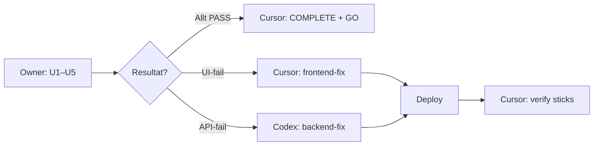

# ORD-48 — Parallellt svep · Cursor + Codex + Owner

**Datum:** 2026-05-20 · **Uppdaterad:** 2026-05-20 (Fas 2)  
**Spec:** [`ORD-48-steg7-bundle-ops-gates.md`](./ORD-48-steg7-bundle-ops-gates.md)  
**Staff UAT:** [`ORD-48-CLOUD-STAFF-UAT.md`](./ORD-48-CLOUD-STAFF-UAT.md)  
**Kalender facit:** [`MOCKUPS/CCO-Kalender-Mockup-v6-UTGANGSLAGE.html`](../MOCKUPS/CCO-Kalender-Mockup-v6-UTGANGSLAGE.html)  
**Förutsätter:** ORD-47 V1 ✅ Owner GO 2026-05-20  
**Prod:** `https://arcana.hairtpclinic.com` · commit `b92f1abd`+

---

## Nuläge (Fas 1 ✅)

| Spår                  | Commit / bevis                                                    | Status         |
| --------------------- | ----------------------------------------------------------------- | -------------- |
| **Codex backend**     | `4cabcbae`+ — bundle, FC-gate, booking 409, legacy consent guard  | ✅ Live i prod |
| **Cursor frontend**   | `659c74cc`+ — steg 7 API, §4/§5 wiring, desktop deeplink          | ✅ Live i prod |
| **Cursor cloud-prep** | `b92f1abd` — UAT-doc, `verify:ord48-prod-sticks`, smoke HTTPS-fix | ✅ Pushed main |
| **Automatiserat**     | ORD-47 9/9 · ORD-48 16/16 · browser capture 3/3                   | ✅ PASS        |

**Fas 1 kvar:** Owner manuell UAT U1–U5 + ev. polish efter resultat.

---

## Regler (läs först)

1. **Filägarskap** — rör inte filer som tillhör annan agent utan koordination.
2. **Additivt** — utöka befintlig bundle/gate-kod; duplicera inte parallella flöden.
3. **Merge-ordning:** Codex PR **före** Cursor om API-kontrakt ändras → deploy → Cursor verify.
4. **Ingen falsk COMPLETE** — `ORD-48-CLOUD-AGENT-COMPLETE.md` skrivs först när owner UAT är rapporterad.

### Filgränser (krock-skydd)

```
Codex  → src/** + tests/ops/**
Cursor → public/** + scripts/verify-* + scripts/capture-* + docs/handover/**
Owner  → manuell UAT + prod GO
```

---

# Fas 1 — Implementering (historik)

## Merge-ordning (utförd)

```
1. Codex  → Fas A (bundle write) + Fas C backend (FC gate) + Fas D backend
2. Cursor → Fas B (steg 7 UI → API) + Fas C/D UI wiring
3. Cursor → verify + ORD-48-CLOUD-STAFF-UAT.md
```

---

## 🤖 CODEX — Fas A + C + D backend ✅

**Äger:** `src/ops/`, `src/routes/`, `tests/ops/`

| Task   | Innehåll                                                                   | Status |
| ------ | -------------------------------------------------------------------------- | ------ |
| **X1** | A1–A4 — atomisk bundle-sign, reject legacy consent, readiness, API readout | ✅     |
| **X2** | C1–C2 — FC 409 på ops-åtgärder; `fitnessSigned` i readout                  | ✅     |
| **X3** | C4 — ingen T-48 FC pre-op mail                                             | ✅     |
| **X4** | D1–D2 — `ready_for_treatment` komposit + booking 409                       | ✅     |
| **X5** | Verify enligt ORD-48 spec                                                  | ✅     |

Sammanfattning: backend levererad @ `4cabcbae` (merged till main/prod).

---

## 🤖 CURSOR — Fas B + C/D UI ✅

**Äger:** `public/major-arcana-preview/app/*`, `server.js` (deeplink shim), verify-scripts

| Task   | Innehåll                                                       | Status |
| ------ | -------------------------------------------------------------- | ------ |
| **C1** | B1–B4 — API-signering; legal gate; §4 status; ett bundle-modal | ✅     |
| **C2** | C3 — §5 op-dag disabled + tooltip vid FC block                 | ✅     |
| **C3** | D3 — rail / §4 bundle-status + agreementReadout                | ✅     |
| **C4** | ORD-47 deeplink + högerpanel (`659c74cc`)                      | ✅     |
| **C5** | `verify:ord48-prod-sticks` + UAT-doc (`b92f1abd`)              | ✅     |

Sammanfattning: [`ORD-48-CURSOR-COMPLETE.md`](./ORD-48-CURSOR-COMPLETE.md)

---

# Fas 2 — UAT + polish (aktiv)

## Flöde



---

## 👤 OWNER — manuell UAT (~35 min)

**Doc:** [`ORD-48-CLOUD-STAFF-UAT.md`](./ORD-48-CLOUD-STAFF-UAT.md)

| #   | Scenario                                           | Pilot                |
| --- | -------------------------------------------------- | -------------------- |
| U1  | Bundle sign → §4 Signerad, `bookable=true`         | Axel                 |
| U2  | Boka FUE utan bundle → 409                         | Dino                 |
| U3  | Ops-dag utan FC → journal blockerad                | Dino + `demoOpDay=1` |
| U4  | Ops-dag med FC → 5 knappar OK                      | Dino                 |
| U5  | `ready_for_treatment` endast vid komplett komposit | Jonas                |

**Rapportera kort:** `U1 PASS, U2 FAIL (409 saknas i UI), …` + screenshot vid FAIL.

**Pre-check (valfritt):**

```bash
npm run verify:ord48-prod-sticks
npm run verify:cloud-document-wiring-prod
```

---

## 🤖 CURSOR — efter owner UAT (eller parallellt polish)

**Äger:** frontend, verify/capture-scripts, handover-rapporter, CI smoke

| #      | Uppgift                                                 | Filer                                                                                                              | Trigger              |
| ------ | ------------------------------------------------------- | ------------------------------------------------------------------------------------------------------------------ | -------------------- |
| **L1** | `ORD-48-CLOUD-AGENT-COMPLETE.md`                        | `docs/handover/ORDERS/`                                                                                            | Owner UAT-resultat   |
| **L2** | UI-fixar (§4 copy, tooltips, deeplink, disabled states) | `patient-master-ui.js`, `cco-kundkort-referens.js`, `cco-hairtp-document-cloud.js`, `cco-avtal-samtycke-bundle.js` | UAT FAIL UI          |
| **L3** | **D3 polish** — kalender-CTA vid `ready_for_treatment`  | `cco-kundkort-referens.js` · mockup v6                                                                             | U5c PARTIAL eller GO |
| **L4** | Dokumentera U5c N/A om CTA skjuts                       | UAT-doc                                                                                                            | Owner beslut         |
| **L5** | `capture-ord48-browser-uat.js` (Playwright, som ORD-47) | `scripts/`                                                                                                         | Efter UI stabilt     |
| **L6** | Bekräfta `deploy-cloud-safe` grön (smoke HTTPS)         | `scripts/smoke-public.sh`                                                                                          | Efter push           |

**Rör INTE:** `src/ops/`, `src/routes/` (utom `server.js` deeplink-shim).

**Todo:**

- [ ] **L1** COMPLETE-rapport när owner rapporterat U1–U5
- [ ] **L2** UI-fixar från UAT (om några)
- [ ] **L3** Kalender-CTA enligt mockup v6 (eller N/A)
- [ ] **L5** Ev. browser capture script
- [ ] **L6** CI smoke grön

---

## 🤖 CODEX — endast vid UAT-gap eller efter GO

**Äger:** backend routes, stores, gates, unit tests

| #      | Uppgift                                                  | Filer                                                          | Trigger                  |
| ------ | -------------------------------------------------------- | -------------------------------------------------------------- | ------------------------ |
| **X6** | **A2 rest** — blockera separat consent-send i komm-panel | `ccoLegacyConsentSendGuard.js`, ev. komm-routes                | UAT visar legacy-flöde   |
| **X7** | 409/`reason`-fix i booking eller journal-gate            | `ccoTreatmentBookingGate.js`, `ccoOperationDayGate.js`, routes | U2/U3 API-fail           |
| **X8** | **ORD-49** steg 2 mail + HD-länk (nästa epok)            | mail/template/backend                                          | Efter ORD-48 GO          |
| **X9** | **ORD-24** foto_samtycke backend                         | scope-consent API                                              | Parallellt om owner vill |

**Rör INTE:** `public/major-arcana-preview/`, handover-UAT-docs, Playwright.

**Todo (vänta på owner UAT om inget FAIL):**

- [ ] **X6** A2 komm-panel guard (valfri polish — inte blocker om UAT PASS)
- [ ] **X7** Backend-fix vid API-fail i UAT
- [ ] **X8/X9** Nästa epok efter owner GO

---

## Copy-paste — Codex

```markdown
ORD-48 backend live (4cabcbae+). Cursor: frontend + UAT-doc klart (b92f1abd).
Prod: verify:ord48-prod-sticks 16/16 PASS.

Din uppgift (endast om owner UAT hittar gap — annars vänta på GO):

1. X6 — blockera legacy separat consent-send i cco-komm-panel (Hair TP)
   Filer: src/ops/ccoLegacyConsentSendGuard.js, ev. komm-routes
2. X7 — om UAT FAIL: fixa 409/reason i booking/journal gates (minimal diff)
3. Verify:
   node --test tests/ops/ccoLegacyConsentSendGuard.test.js
   node --test tests/ops/ccoTreatmentBookingGate.test.js
   npm run cco:verify-fas-a-readiness

Rör INTE public/major-arcana-preview eller docs/handover UAT-filer.
Branch: ord-48/codex-a2-komm-guard (eller feat/ord-48-uat-fix)
Leverera sammanfattning + verify PASS/FAIL sist.
```

---

## Copy-paste — Cursor

```markdown
Owner kör ORD-48 U1–U5 manuellt (ORD-48-CLOUD-STAFF-UAT.md).

Cursor tar:

1. ORD-48-CLOUD-AGENT-COMPLETE när UAT-resultat finns
2. UI-fixar från UAT (§4, §5, deeplink, tooltips)
3. D3 kalender-CTA enligt CCO-Kalender-Mockup-v6-UTGANGSLAGE.html
4. Ev. scripts/capture-ord48-browser-uat.js
5. Bekräfta deploy-cloud-safe grön

Rör INTE src/ops eller src/routes (utom server.js shim).
Handover: docs/handover/ORDERS/ORD-48-PARALLEL-SVEP-3-AGENTS.md
```

---

## Nästa epok (efter ORD-48 GO)

| ORD                   | Codex                     | Cursor                  |
| --------------------- | ------------------------- | ----------------------- |
| **49** steg 2 mail    | Mail/template/backend     | Preview i kundkort §1   |
| **51** §-kort body V2 | Data/enrichment om behövs | §3/§4/§8/§9 UI-innehåll |
| **24** foto           | scope-consent API         | §6 modal + status       |

---

## Definition of done (hela ORD-48)

- [x] Codex sammanfattning + verify PASS
- [x] Cursor sammanfattning + wiring verify PASS
- [x] Merge A → B → C/D → deploy
- [x] `ORD-48-CLOUD-STAFF-UAT.md` + `verify:ord48-prod-sticks`
- [ ] Owner manuell UAT U1–U5
- [ ] `ORD-48-CLOUD-AGENT-COMPLETE.md`
- [ ] Owner prod GO

---

## Leveransformat (varje agent — **efter** jobbet)

```markdown
## ORD-48 [Agent] — sammanfattning

- Scope implementerat: …
- Filer ändrade: …
- Verify: (kommandon + PASS/FAIL)
- Manuell stickprov: …
- Kvar / blocker: …
```

---

_Hair TP · ORD-48 · Fas 2 UAT + polish · 2026-05-20_
