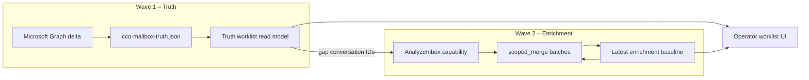

# CCO Fas J: Full enrichment backfill (Hair TP Clinic)

## Goal

Mac Mail-modellen för operatören: **100 % av synlig inbox-mail i worklist (truth wave 1) ska ha gått genom AnalyzeInbox/CCO** innan morgondagens arbete. Varje rad ska bära CCO-signaler (intent, workflowLane, risk/prioritet) — inte bara mailbox-etikett ("Contact").

| Miljö         | Värde                                                                                |
| ------------- | ------------------------------------------------------------------------------------ |
| Prod          | `https://arcana.hairtpclinic.se`                                                     |
| Tenant        | `hair-tp-clinic`                                                                     |
| Mailboxes (7) | `kons`, `info`, `contact`, `egzona`, `fazli`, `marknad`, `receipt` @hairtpclinic.com |

## Architecture



1. **Truth (wave 1):** `cco_truth_delta_sync` fyller `cco-mailbox-truth.json`. Worklist-read-model visar alla aktiva trådar direkt.
2. **Enrichment (wave 2):** `AnalyzeInbox` skriver `conversationWorklist` till capability analysis store. Scheduler jobb `cco_inbox_enrichment_full_backfill` fyller gap mellan truth och baseline.
3. **scoped_merge:** Varje batch uppdaterar bara angivna `scopedConversationIds` och mergar in i senaste baseline via `mergeWorklistEnrichmentOutput`.

### Begränsningar (före Fas J)

| Begränsning        | Värde                                          |
| ------------------ | ---------------------------------------------- |
| Bootstrap lookback | 90 dagar                                       |
| Graph cap          | ~50 meddelanden/användare                      |
| enrichment_fresh   | Hoppar över körning om baseline &lt; 24 h      |
| scoped_merge       | Finns för delta, ingen full truth-gap backfill |

### Fas J-ändringar

| Komponent                            | Ändring                                                      |
| ------------------------------------ | ------------------------------------------------------------ |
| `runCcoInboxEnrichmentFullBackfill`  | Truth gap → batch scoped_merge                               |
| `cco_inbox_enrichment_full_backfill` | Nytt scheduler-jobb (manuellt + veckovis säkerhetsintervall) |
| `GET /ops/cco/enrichment/coverage`   | Coverage + `readyForWork`                                    |
| Config                               | Batch 15, bootstrap cap 200, lookback 365 för full backfill  |

## Execution runbook (tonight)

### 1. Deploy

Push till `main` och kör GitHub Actions `arcana-deploy-cloud-safe` (vid 502: `skip_predeploy=true`).

### 2. Trigger full backfill

**GitHub Actions (rekommenderat om lokala MFA-hemligheter saknas):**

```bash
gh workflow run arcana-deploy-cloud-safe \
  --repo <org>/major-arcana \
  -f tenant_id=hair-tp-clinic \
  -f skip_predeploy=true
```

Efter deploy, kör backfill via autentiserad API:

```bash
export BASE_URL=https://arcana.hairtpclinic.se
export ARCANA_DEFAULT_TENANT=hair-tp-clinic
# ARCANA_OWNER_EMAIL, ARCANA_OWNER_PASSWORD, ARCANA_OWNER_MFA_SECRET

node scripts/run-cco-full-enrichment-backfill.js --trigger
```

**curl (efter inloggning / bearer token):**

```bash
curl -sS -X POST "$BASE_URL/api/v1/ops/scheduler/run" \
  -H "Authorization: Bearer $TOKEN" \
  -H "Content-Type: application/json" \
  -d '{"jobId":"cco_inbox_enrichment_full_backfill","tenantId":"hair-tp-clinic"}'
```

Jobbet:

1. Kör `mode: full` med lookback 365 dagar och Graph cap 200/användare (trigger `cco_full_backfill`).
2. Beräknar gap mot truth read model.
3. Kör `scoped_merge` i batchar om 15 tills gap ≈ 0 eller stall (max 2 rundor utan framsteg).

**Förväntad körtid:** 30–90 min beroende på gap-storlek och Graph-begränsningar.

### 3. Poll coverage

```bash
node scripts/run-cco-full-enrichment-backfill.js --coverage-only
```

eller:

```bash
curl -sS "$BASE_URL/api/v1/ops/cco/enrichment/coverage?tenantId=hair-tp-clinic" \
  -H "Authorization: Bearer $TOKEN"
```

## Verification criteria

| Mått              | Tröskel     | `readyForWork`             |
| ----------------- | ----------- | -------------------------- |
| `coveragePercent` | ≥ 99.5 %    | ja                         |
| `gapCount`        | 0           | ja                         |
| Per mailbox       | alla ≥ 99 % | kontrollera `perMailbox[]` |

**Manuell UI-kontroll (morgon):**

- Öppna CCO worklist på prod.
- Bekräfta att rader visar lane/intent (Oklart, Hög risk, Operation) — inte enbart mailbox-namn.
- Stickprov: 2–3 konversationer per mailbox (särskilt `contact`, `info`, `kons`).

## Morning checklist (operator)

- [x] `GET /ops/cco/enrichment/coverage` → `readyForWork: true`
- [x] Worklist: inga uppenbart "nakna" rader utan CCO-klassificering
- [x] `cco_truth_delta_sync` körde under natten (scheduler status)
- [x] Nya inkommande mail efter backfill: verifiera att delta scoped_merge triggas (nya meddelanden → enrichment inom ~5 min)

## Rollback / re-run

| Scenario              | Åtgärd                                                                                          |
| --------------------- | ----------------------------------------------------------------------------------------------- |
| Ofullständig backfill | Kör `cco_inbox_enrichment_full_backfill` igen (hoppar **inte** över p.g.a. enrichment_fresh)    |
| Felaktig baseline     | Kör full jobb igen; scoped_merge skriver över scoped IDs                                        |
| Graph rate limit      | Vänta 15 min, kör om med mindre batch: `ARCANA_SCHEDULER_CCO_INBOX_FULL_BACKFILL_BATCH_SIZE=10` |
| Akut rollback deploy  | Standard `rollback-runbook`; truth store påverkas inte av enrichment                            |

## Script reference

```bash
# Endast coverage
node scripts/run-cco-full-enrichment-backfill.js --coverage-only

# Coverage + trigger backfill
node scripts/run-cco-full-enrichment-backfill.js --trigger

# Poll tills ready (max 90 min)
node scripts/run-cco-full-enrichment-backfill.js --trigger --wait --wait-minutes=90
```

## Config (env)

| Env                                                          | Default | Beskrivning             |
| ------------------------------------------------------------ | ------- | ----------------------- |
| `ARCANA_SCHEDULER_CCO_INBOX_FULL_BACKFILL_BATCH_SIZE`        | 15      | scoped_merge batch      |
| `ARCANA_SCHEDULER_CCO_INBOX_BOOTSTRAP_MAX_MESSAGES_PER_USER` | 200     | Graph cap full backfill |
| `ARCANA_SCHEDULER_CCO_INBOX_FULL_BACKFILL_LOOKBACK_DAYS`     | 365     | Lookback full bootstrap |

## Related code

- `src/ops/scheduler.js` — `runCcoInboxEnrichmentFullBackfill`, job `cco_inbox_enrichment_full_backfill`
- `src/ops/ccoInboxEnrichmentCoverage.js` — gap/coverage
- `src/routes/ops.js` — `GET /ops/cco/enrichment/coverage`
- `scripts/run-cco-full-enrichment-backfill.js` — CLI trigger/poll
