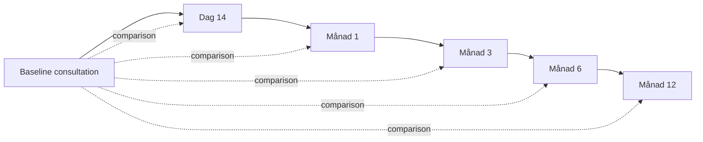

# Aisia Follow-up Workflow

**Scope:** Hair TP post-transplant / PRP follow-up med DS-3 re-scan

---

## Tidslinje

## Per timepoint

| Steg                 | Actor           | CCO action                                |
| -------------------- | --------------- | ----------------------------------------- |
| 1. Boka uppföljning  | Reception       | `ccoBookingStore` — länk encounter        |
| 2. Aisia capture     | Behandlare      | Oförändrat i Aisia                        |
| 3. Import            | Operatör        | `sessionType=follow_up`, link encounterId |
| 4. Jämförelse        | System          | Auto-förslag: baseline vs current metrics |
| 5. Klinisk bedömning | Behandlare      | `clinicianConclusion` + verify            |
| 6. Patientinfo       | Portal (senare) | Förenklad SV progress-text                |

## Avvikelsehantering

| Signal                                 | CCO flagga                            |
| -------------------------------------- | ------------------------------------- |
| Metric delta under förväntat intervall | `needs_extra_follow_up` på comparison |
| Saknad follow-up vid M3                | Task i arbetskö (framtida)            |
| Session `needs_review`                 | Review queue — ingen auto-merge       |

## Metric comparison rules (MVP)

- Delta beräknas: `current - baseline` för numeriska metrics
- Positiv delta på hårantal = förbättring (Aisia convention)
- Icke-numeriska: side-by-side text, ingen auto-tolkning

## Journal integration

- Verified scalp analysis refereras i TP-journal fält (manuell länk)
- Inga auto-skrivna journaltexter från Aisia AI

---

_source: owner spec 2026-05-30_
