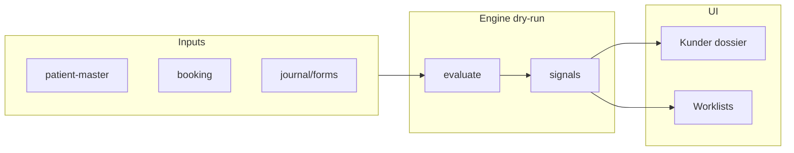

# CCO Automation OS — Gemensam plan och arkitektur (2026-06-03)

> **Kundresa (2026-06-03):** Execution och utskicksordning = [`CCO-KUNDRESA-9-STEG-HAIR-TP-2026-06-03.md`](./CCO-KUNDRESA-9-STEG-HAIR-TP-2026-06-03.md). Registry-regler = [`CCO-AUTOMATION-REGISTRY-READINESS-2026-06-03.md`](./CCO-AUTOMATION-REGISTRY-READINESS-2026-06-03.md). **Ogiltigt:** T-48 friskförsäkran, pre-info som eget steg, separat samtycke vid offert, `missing_form` / `ready_for_visit` som v1-regler.

**Status:** Analys och arkitektur — **ingen implementation** i denna fas.  
**Master-dokument:** Denna fil (ChatGPT + Cursor i ett flöde).  
**Uppdelat per källa:** [ChatGPT-strategi](./CCO-AUTOMATION-OS-CHATGPT-BRIEF-2026-06-03.md) · [Cursor-teknisk](./CCO-AUTOMATION-OS-CURSOR-TECHNICAL-2026-06-03.md)  
**UX:** [Gemensam produktplan](./CCO-SMART-FUNCTIONS-PRODUCT-PLAN-2026-06-03.md)  
**JSON:** `data/reports/cco-automation-os-inventory.json` (lokal; `data/` gitignored)

---

# DEL A — ChatGPT strategi (Automation OS)

## Mål

CCO ska **inte bara vara ett journalsystem**. CCO ska vara ett **automatiserat operationssystem för kliniken**.

Allt som går att **förbereda, flagga, föreslå, sortera, påminna, sammanställa och kontrollera** ska göras automatiskt — men **kritiska vård-/journal-/avtalsbeslut** ska fortfarande ha **mänskligt godkännande**.

### Viktig regel (AI + compliance)

- AI får hjälpa med **struktur, förslag, prioritering och sammanfattning**.
- AI får **inte** köra externa AI-flöden på **journaltext/patientdata** utan explicit **GO**.
- CCO-scope: journalinnehåll ska **inte** till extern AI/tredjelands-AI.

### Principer

| Princip                     | Betydelse                                                            |
| --------------------------- | -------------------------------------------------------------------- |
| Automation = ja             | Regler, events, worklists, gates                                     |
| AI = ja, kontrollerat       | Förslag — inte auto-action                                           |
| Extern AI på journaldata    | **Nej** utan GO                                                      |
| Autoapproval / massapproval | **Nej**                                                              |
| Human approval              | Journal, avtal, samtycke, photo, mail, merge, import, finance export |

---

## 11 lager (bygg i lager, inte AI-gimmicks)

1. Data foundation
2. Journey engine
3. Next-best-action
4. Worklists
5. Communication automation
6. Clinical safety automation
7. Booking/calendar automation
8. Agreement/consent automation
9. Photo/Drive review automation
10. Finance/CF automation
11. AI copilots — bara där det är säkert

---

## P0 — Automatisering för verksam CCO

| Modul          | Automation                                                     | Mänsklig kontroll            |
| -------------- | -------------------------------------------------------------- | ---------------------------- |
| Kunder         | Segment, flaggor, nextStep                                     | Personal väljer åtgärd       |
| Journal        | Mall, identitet, review-varning                                | Personal signerar            |
| Bokning        | Bokning → kund → encounter → journal                           | Personal bekräftar avvikelse |
| Formulär       | Hälsodekl (steg 3); friskförsäkran **endast ops-dag** (steg 8) | Patient signerar             |
| Avtal/samtycke | Legal gate, betänketid, samtycken                              | Owner/legal godkänner        |
| Review-köer    | Import, bilder, mail, encounter                                | Operatör godkänner           |
| Timeline       | Kronologisk kundresa                                           | Read-only/audit              |
| Audit          | Känsliga händelser                                             | Owner/revisor                |

---

## 10 smart functions (ChatGPT)

1. **Journey Orchestrator** — fakta: booking + encounter + journal + forms + assets + agreements + payments + communication
2. **Next Best Action** — regelbaserat på `/kunder.html` (deterministiskt först)
3. **Worklist Engine** — dagens patienter, saknar X, review-köer
4. **Smart Communication** — föreslå → godkänn → skicka
5. **Agreement + Consent** — legal_review, signering, betänketid, bookable gate
6. **Clinical Safety** — identitet, review-material, lock, audit
7. **Calendar + Booking Intelligence** — idag/redo/saknar X; senare no-show
8. **Photo Review** — gruppering, förslag fas/bodyArea, **ej** autoapprove
9. **Mail** — truth, true unanswered, SLA, Svarstudio
10. **CF** — kvitto, recurring, månadsstängning, Fortnox (GO)

---

## Byggordning ChatGPT (Fas 1–5)

| Fas | Innehåll                                                             |
| --- | -------------------------------------------------------------------- |
| 1   | Kunder 100%, kalender kopplad, dossier, journey readout, NBA         |
| 2   | Photo/Import/Mail/Encounter review + Missing forms/agreements queues |
| 3   | Rules store, triggers, conditions, approval queue, audit, flags      |
| 4   | Smart communication (templates, reminders, Svarstudio)               |
| 5   | AI copilot (metadata/redacted only)                                  |

---

## ChatGPT — första build

**CCO Automation Registry + Dry-run Runner** — räknar missing form/journal/agreement/photo review/ready for visit/missing encounter → visar **What / Why / Next** i Kunder. Säkert, kraftfullt.

---

# DEL B — Cursor teknisk analys (repo 2026-06-03)

**Källor:** `major-arcana` · P1.2 `525a643a` · `CCO-SYSTEM-SCOPE.md` · Kunder P0.1–P1.2.

## B.1 Finns redan

| Automation              | Modul                              | Status                              |
| ----------------------- | ---------------------------------- | ----------------------------------- |
| segmentStats            | `ccoKunderEnrichment`              | **DONE**                            |
| nextStep (text)         | `computeNextStep`                  | **PARTIAL**                         |
| Mina / staffOwnership   | `ccoKunderStaffOwner`              | **DONE**                            |
| Action capability       | `cco-kunder-actions.js`            | **PARTIAL**                         |
| Treatment booking gate  | `ccoTreatmentBookingGate`          | **DONE**                            |
| Agreement + cooling off | `ccoTreatmentAgreementStore`       | **PARTIAL** — saknar `legal_review` |
| Journey 12 steg         | `ccoCustomerJourneyStore`          | **PARTIAL** — ej derived            |
| Timeline                | `ccoUnifiedTimelineBuilder`        | **PARTIAL**                         |
| Photo / Import review   | API + canary write                 | **PARTIAL**                         |
| Mail worklist           | `ccoMailboxTruthWorklistReadModel` | **PARTIAL**                         |
| CF rules                | `ccoExpenseRuleStore`              | **PARTIAL**                         |
| Identity needs_review   | patient master                     | **DONE**                            |
| Meridiq consent runtime | `meridiqConsentCatalogRuntime.js`  | **PARTIAL**                         |

**Readiness:** Kunder ~97% desktop / ~98% mobil · **Automation OS ~35%**

## B.2 Saknas (per domän)

Kunder: derived journey, strukturerad NBA, unified worklists, comms pipeline.  
Kalender: ops flags. Formulär: cco-forms i shell. Avtal: legal_review + sign write.  
Kommunikation: approve→send. Ops: enhetlig kö-hub.

## B.3 Automation Rules Engine (förslag)

- `ccoAutomationRegistry.js` + `ccoAutomationRunner.js`
- Dry-run default · human approval queue · audit · RBAC · feature flags · canary
- API: `GET .../automation/catalog|evaluate|worklists`
- Kunder: `customers-shell` + `includeAutomation=1` → `automationSignals[]`

## B.4 Automation catalog (status)

| ID                                  | Status  | Approval |
| ----------------------------------- | ------- | -------- |
| customer.missing_journal            | PARTIAL | nej      |
| customer.missing_agreement          | PARTIAL | ja       |
| customer.ready_for_treatment        | MISSING | nej      |
| customer.needs_photo_review         | PARTIAL | ja       |
| booking.blocked_by_agreement_gate   | DONE    | ja       |
| customer.missing_health_declaration | MISSING | ja       |
| communication.suggest_form_reminder | MISSING | ja       |

Full lista: `cco-automation-os-inventory.json`.

## B.5 AI policy (Cursor)

Metadata/redacted: ja. Journaltext→extern AI: nej. Autoapprove/merge: nej. Dry-run v1: ingen LLM.

## B.6 Cursor — första build (enig med ChatGPT)

Registry + dry-run · 6 regler v1 · dossier “Smart nästa steg” · **inga writes** · verify-script senare.

**Constraints:** ingen demo/support · ingen extern AI · ingen auto/massapproval · ingen ny import · `ccoStaff`-router-mönster.

---

# DEL C — Gemensam slutsats

| Fråga               | Svar                                                                   |
| ------------------- | ---------------------------------------------------------------------- |
| **Vision**          | Automation OS, inte journal-only (ChatGPT)                             |
| **Verklighet idag** | Stark Kunder-yta; svag journey/consent/comms automation (Cursor)       |
| **P0**              | Journey derived · NBA What/Why/Next · missing queues · calendar ops    |
| **P1**              | Comms suggest · worklists · photo/mail assist                          |
| **P2**              | AI copilot · scheduling · Aisia (pausad)                               |
| **Första build**    | **Registry + dry-run + Kunder dossier panel** (ChatGPT + Cursor eniga) |

---

## Referenser

- [CCO-AUTOMATION-OS-CHATGPT-BRIEF-2026-06-03.md](./CCO-AUTOMATION-OS-CHATGPT-BRIEF-2026-06-03.md) — full ChatGPT-text
- [CCO-AUTOMATION-OS-CURSOR-TECHNICAL-2026-06-03.md](./CCO-AUTOMATION-OS-CURSOR-TECHNICAL-2026-06-03.md) — full Cursor-text
- [CCO-KUNDER-SEGMENT-READINESS-2026-06-03.md](./CCO-KUNDER-SEGMENT-READINESS-2026-06-03.md)
- [CCO-SYSTEM-SCOPE.md](./CCO-SYSTEM-SCOPE.md)

---

_2026-06-03 · Gemensam master + separata källfiler._
