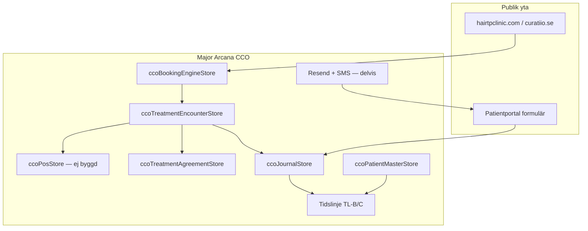

# CCO Unified System Plan — Bokning + Kassa + Journal

**Status:** Aktiv strategi  
**Senast uppdaterad:** 2026-05-20  
**Ägare:** Hair TP Clinic / Curatiio — Major Arcana (CCO)  
**Prod:** `https://arcana.hairtpclinic.se`

**Relaterade dokument**

| Dokument                                                                 | Innehåll                                                      |
| ------------------------------------------------------------------------ | ------------------------------------------------------------- |
| **[CCO-SYSTEM-SCOPE.md](./CCO-SYSTEM-SCOPE.md)**                         | **Punklista — vad systemet ska innehålla (start här)**        |
| [CLIENTO-INVENTORY.md](./CLIENTO-INVENTORY.md)                           | Legacy Cliento — moduler, tjänster, ID (Hair TP + Curatiio)   |
| [MERIDIQ-INVENTORY.md](./MERIDIQ-INVENTORY.md)                           | Legacy Meridiq — formulär, tjänster, POS (Hair TP + Curatiio) |
| [JOURNAL-DATAMODELL.md](./JOURNAL-DATAMODELL.md)                         | SharePoint-källor, fältlistor, PDL-krav                       |
| [cco-patient-journal-build-plan.md](./cco-patient-journal-build-plan.md) | Journal-byggplan Fas 0–10                                     |
| [cco-booking-mvp-spec.md](./cco-booking-mvp-spec.md)                     | Bokningsmotor MVP                                             |
| [cco-treatment-agreement-spec.md](./cco-treatment-agreement-spec.md)     | Behandlingsavtal + betänketid                                 |
| [web-to-arcana-bridge.md](./web-to-arcana-bridge.md)                     | Webb → Arcana ingest                                          |
| [MASTER-TODO.md](./MASTER-TODO.md)                                       | Operativ checklista                                           |

---

## 1. Vision

Ett **eget kliniksystem** i Major Arcana (CCO) som samlar:

```
Patient → Behandlingstillfälle (encounter) → journal + samtycken + kommunikation + POS
```

**Princip:** Arcana/CCO **äger journalen framåt**. Cliento och Meridiq är legacy-källor som fasas ut efter migrering — inte målbild.

**Styrkor att behålla**

| Källa              | Ta med                                                                                                      |
| ------------------ | ----------------------------------------------------------------------------------------------------------- |
| **Cliento**        | Virtuella bokningsbanor (Online/Fysisk), smart slots, per-resurs SMS/mejl, ICS, kassa/POS-flöde, VIP-länkar |
| **Meridiq**        | Formulärbyggare-innehåll, samtycken, PDF-arkiv, offer accept/reject, journalmallar, QA-rapporter            |
| **Arcana (byggt)** | Enhetlig tidslinje, behandlingsplan, avtal, Drive-migration, CMO/CAO, audit                                 |

---

## 2. Nuvarande landskap (2026-05-20)

| System           | Styrka                                           | Skala                                                    | Arcana-status                                |
| ---------------- | ------------------------------------------------ | -------------------------------------------------------- | -------------------------------------------- |
| **Cliento**      | Bokning, kalender, kassa, SMS/mejl kring bokning | ~55 tjänster, partner 1650                               | Plan A live; prod `cliento_booking_disabled` |
| **Meridiq**      | Journal, formulär, samtycken, offerter, QA       | 6 455 patienter, 82 tjänster, 16 formulär, 39+ samtycken | Legacy SoR — innehåll ska migreras           |
| **Major Arcana** | Kundresa bokning → journal → avtal → uppföljning | 7 349 Cliento-kunder, 57 558 Drive-filer                 | ~65 % av visionen kodad                      |

### Arcana journaltyper idag (`ccoJournalStore.js`)

```javascript
'historical_import'; // PDF från Drive/Meridiq-export
'tp_treatment'; // TP behandlingsjournal (38 fält)
'health_declaration'; // Hälsodeklaration
'fitness_certificate'; // Friskförsäkran
'follow_up'; // Uppföljning (mån 4/6/12)
'prp_treatment'; // PRP / microneedling
'consultation_plan'; // Behandlingsplan (Arcana-specifik)
```

---

## 3. Målarkitektur



**Encounter-koppling:** Varje journalpost bär `treatmentEncounterId` (TL-B.2 live för foton; utökas till alla typer i Fas 2).

**Signering:** `draft → signed → corrected` (rättelse = ny post, aldrig overwrite). PDF genereras vid signering och lagras som bilaga (Meridiq-paritet).

---

## 4. Fasplan

| Fas   | Namn               | Leverans                                                          | Beroenden                 |
| ----- | ------------------ | ----------------------------------------------------------------- | ------------------------- |
| **0** | Export & mapping   | Meridiq API-export formulär/samtycken/tjänster; trippel-ID-tabell | Meridiq API-access        |
| **1** | Bokning cutover    | Arcana engine ersätter Cliento widget; SMS/mejl kring bokning     | Resend live, slot-paritet |
| **2** | Journal & formulär | Alla Meridiq-formulär som Arcana-scheman + UI; PDF vid sign       | Fas 0 export              |
| **3** | Kommunikation      | Offer accept/reject, påminnelser, mallbibliotek                   | Resend + SMS-provider     |
| **4** | Kassa/POS          | Produkter, kvitton, fakturor, presentkort                         | Fas 1 bokning             |
| **5** | QA & cutover       | Meridiq read-only; compliance-rapporter i Arcana                  | Fas 2–4                   |

**Pågående parallellt:** Drive enrich → prod (`migration:enrich-drive-ids`), TL-C (alla journaltyper per encounter), J-7/J-8 agent-påminnelser.

---

## 5. Meridiq formulär → Arcana — migreringsmatris (hela projektet)

### 5.1 Fälttyps-översättning

| Meridiq typ      | Antal (TP Behandling) | Arcana UI-typ                        | Store-fält                     |
| ---------------- | --------------------- | ------------------------------------ | ------------------------------ |
| `textbox`        | 30                    | `text` / `textarea` / section header | `fields.{key}` string          |
| `yes_no`         | 24                    | `tristate` (Ja/Nej)                  | `fields.{key}` boolean \| null |
| `yes_no_textbox` | 5                     | `tristate` + villkorlig text         | boolean + `{key}Text` string   |

Meridiq export-API: `GET /api/v2/questionary/{id}` → `questions[]` med `type`, `title`, `options`.

### 5.1b Arcana metadata på varje migrerad post

| Fält                    | Syfte                                                                                        |
| ----------------------- | -------------------------------------------------------------------------------------------- |
| `sourceSystem`          | `'meridiq'`                                                                                  |
| `sourceQuestionaryId`   | Meridiq template ID (t.ex. `16411`)                                                          |
| `sourceResponseId`      | Meridiq completed form ID (per patient)                                                      |
| `formVariant`           | `'hair_tp'` \| `'curatiio_bleph'` \| `'curatiio_ortho'` \| `'curatiio_injection'` \| `'eng'` |
| `treatmentEncounterId`  | Koppling till encounter (TL-B/C)                                                             |
| `signedPdfAttachmentId` | Arcana fil-ref efter signering                                                               |

---

### 5.2 Hälsodeklarationer (patient fyller i)

| #   | Meridiq ID    | Meridiq titel                                          | Fylls av | Arcana `journalType` | `formVariant`        | SharePoint-källa                                                  | Kopplas till encounter                      | Signering                 | Fas | Status Arcana                                                                                 |
| --- | ------------- | ------------------------------------------------------ | -------- | -------------------- | -------------------- | ----------------------------------------------------------------- | ------------------------------------------- | ------------------------- | --- | --------------------------------------------------------------------------------------------- |
| H1  | **16414**     | Hälsodeklaration \| Hair TP Clinic                     | Patient  | `health_declaration` | `hair_tp`            | `1. Hälsodeklaration TP, PRP, Microneedling PRF.docx`             | Konsultation (encounter typ `consultation`) | Patient + staff vid behov | 2   | Schema i JOURNAL-DATAMODELL 2.2; UI `journal-pre-treatment-forms.js`; **0 signerade på prod** |
| H2  | **16415**     | Hälsodeklaration \| Ögonlocksplastik                   | Patient  | `health_declaration` | `curatiio_bleph`     | Curatiio-variant (ej i SharePoint-lista — exportera från Meridiq) | Konsultation Curatiio                       | Patient                   | 2   | **Ny variant** — samma store-typ, annat fältschema                                            |
| H3  | **14878**     | Hälsodeklaration \| Ortopediska injektionsbehandlingar | Patient  | `health_declaration` | `curatiio_ortho`     | Exportera från Meridiq                                            | Konsultation ortopedi                       | Patient                   | 2   | **Ny variant**                                                                                |
| H4  | **16472**     | Hälsodeklaration \| Estetiska injektionsbehandlingar   | Patient  | `health_declaration` | `curatiio_injection` | Exportera från Meridiq                                            | Konsultation estetik                        | Patient                   | 2   | **Schema + UI-variant**                                                                       |
| H5  | _(okänd ID)_  | ENG \| Health Questionnaire                            | Patient  | `health_declaration` | `eng`                | Engelsk översättning av H1                                        | Konsultation                                | Patient                   | 2   | **Ny variant**                                                                                |
| H6  | _(duplicate)_ | Copy - Hälsodeklaration                                | —        | —                    | —                    | —                                                                 | —                                           | —                         | —   | **Migrera ej** — dedupe mot H1                                                                |

**Webb-sync idag:** `/screen` på webben mappar till H1-fält (JOURNAL-DATAMODELL 2.2). Curatiio-varianter saknas på webben.

**Migreringsscript (Fas 0):**

```bash
# Per template: exportera schema + alla ifyllda svar
GET /api/v2/questionary/16414
GET /api/v2/client/{id}/questionaries   # completed + PDF URL
```

**Import till Arcana:** `POST /api/v1/cco-journal/entry` med `journalType: health_declaration`, `status: signed` om Meridiq-PDF finns, `metadata.sourceResponseId`.

---

### 5.3 Friskförsäkran (patient + personal)

| #   | Meridiq ID | Meridiq titel                      | Arcana `journalType`  | `formVariant`    | SharePoint                       | Encounter                                          | Signering                                | Fas | Status                          |
| --- | ---------- | ---------------------------------- | --------------------- | ---------------- | -------------------------------- | -------------------------------------------------- | ---------------------------------------- | --- | ------------------------------- |
| F1  | **16413**  | Friskförsäkran \| TP               | `fitness_certificate` | `hair_tp`        | `5. Friskförsäkran TP 2025.docx` | Inför ingrepp (encounter typ `transplant` / `prp`) | Patient + staff (`/friskforsakran` live) | 2   | UI byggd; prod-signering saknas |
| F2  | **16389**  | Friskförsäkran \| Ögonlocksplastik | `fitness_certificate` | `curatiio_bleph` | Exportera Meridiq                | Inför ögonlocksplastik                             | Patient + staff                          | 2   | **Ny variant**                  |

**Gate i Arcana:** Behandlingsplan (`consultation_plan`) kräver signerad hälsodeklaration. TP-ingrepp kräver signerad friskförsäkran (patient-master-ui.js).

---

### 5.4 Behandlingsjournaler (personal)

| #   | Meridiq ID | Meridiq titel                       | Fält                      | Arcana `journalType` | `formVariant` / tillfälle | Encounter               | PDF     | Fas | Status                                                                        |
| --- | ---------- | ----------------------------------- | ------------------------- | -------------------- | ------------------------- | ----------------------- | ------- | --- | ----------------------------------------------------------------------------- |
| J1  | **16411**  | Journal \| TP Behandling            | 59 (52 data + 7 rubriker) | `tp_treatment`       | `hair_tp`                 | `transplant` (DHI/FUE)  | Ja (S3) | 2   | ✅ **52 fält** schema-driven (`journal-tp-schemas.js` + `journal-tp-form.js`) |
| J2  | **16412**  | Journal \| TP Efterbehandling (PRP) | 24                        | `prp_treatment`      | `tp_post_op`              | `prp` efter TP          | Ja      | 2   | ✅ schema-driven (`journal-prp-schemas.js`)                                   |
| J3  | **14988**  | Journal \| PRP, PRF, Microneedling  | 12                        | `prp_treatment`      | `prp_skin`                | `prp` / `microneedling` | Ja      | 2   | ✅ schema-driven (`journal-prp-schemas.js`)                                   |
| J4  | **16388**  | Journal \| Ögonlocksplastik         | 15                        | `bleph_treatment`    | `curatiio_bleph`          | `blepharoplasty`        | Ja      | 3   | ✅ schema-driven (`journal-bleph-schemas.js` + `journal-bleph-form.js`)       |
| J5  | _(draft)_  | FÖRSLAG \| Journal TP               | 59                        | `tp_treatment`       | —                         | —                       | —       | —   | **Migrera ej** — använd J1 som canonical                                      |

**J1 fältmapping (Meridiq 16411 → Arcana, urval):**

| Meridiq-sektion                              | Arcana-fält (`tp_treatment`)                                                            |
| -------------------------------------------- | --------------------------------------------------------------------------------------- |
| Metod FUE/DHI/kombination                    | `metodFue`, `metodDhi`, `metodKombination` _(legacy: `metod`)_                          |
| Områden vikar/krona/front/skägg/ögonbryn/ärr | `omradeVikar` … `omradeArr` _(legacy: `behandlingsomraden[]`)_                          |
| Ytterligare område                           | `ytterligareOmrade` + `ytterligareOmradeText`                                           |
| Pre-kontroll legitimation/risker/frisk/48h   | `giltigLegitimationVisad`, `informeradRisker`, `fulltFrisk`+text, `alkoholNarkotika48h` |
| Vitalparametrar                              | `blodtryckMmHg`, `vitalKlockslag` _(legacy: `puls`)_                                    |
| Observationer under ingrepp                  | `obsLangreHarligne` … `obsSegHud` _(legacy: `observationerUnderIngrepp[]`)_             |
| Grafts singel/dubbel/trippel/kvadrupel       | `graftsSingel` … `graftsTotalt`                                                         |
| Tidsstämplar (planering → patient lämnar)    | `tidPlanering` … `tidPatientLamnar`                                                     |
| Bedövningsmängder                            | `bedovningCarbocainMl` … `bedovningTribonatMl`                                          |
| Läkemedel utlämnade                          | `lakemedelDalacin`, `lakemedelBetapred`, `lakemedelIbuprofen`                           |

**Gap J1:** ~~Exportera full `questions[]` från Meridiq 16411~~ — klart via `buildJournalSchemas.py` → `journal-tp-schemas.js`.

---

### 5.5 Uppföljningsjournaler (personal)

| #   | Meridiq ID | Meridiq titel                                  | Arcana `journalType` | `fields.tillfalle` | Encounter    | Fas            | Status |
| --- | ---------- | ---------------------------------------------- | -------------------- | ------------------ | ------------ | -------------- | ------ | -------------------------------------------- |
| U1  | **16407**  | Journal \| TP Uppföljning (4 månader)          | 8                    | `follow_up`        | `4_manader`  | `followup_4m`  | 2      | ✅ schema-driven                             |
| U2  | **16409**  | Journal \| TP Uppföljning (6 månader)          | 8                    | `follow_up`        | `6_manader`  | `followup_6m`  | 2      | ✅ schema-driven                             |
| U3  | **16390**  | Journal \| TP Resultatuppföljning (12 månader) | 1                    | `follow_up`        | `12_manader` | `followup_12m` | 2      | ✅ schema-driven _(Meridiq-mall har 1 fält)_ |

**Automatik (Fas 7):** Scheduler skapar draft `follow_up` X månader efter encounter `transplant` signed date.

---

### 5.6 Sammanfattning — formulär per varumärke

| Varumärke             | Hälsodekl | Friskförsäkran   | Behandlingsjournal | Uppföljning | Totalt aktiva  |
| --------------------- | --------- | ---------------- | ------------------ | ----------- | -------------- |
| **Hair TP**           | H1        | F1               | J1, J2, J3         | U1, U2, U3  | **8**          |
| **Curatiio ögonlock** | H2        | F2               | J4                 | —           | **3**          |
| **Curatiio ortopedi** | H3        | _(ev. separat)_  | —                  | —           | **1+**         |
| **Curatiio estetik**  | H4        | _(via samtycke)_ | —                  | —           | **1+**         |
| **Engelska**          | H5        | —                | —                  | —           | **1**          |
| **Utkast/dubbletter** | H6        | —                | J5                 | —           | **Migrera ej** |

**Rekommenderad store-strategi:** Behåll 7 befintliga `journalType` + lägg till **`bleph_treatment`** (och ev. `procedure_treatment` generisk för Curatiio). Differentiera med `formVariant` + `fields` schema per variant — undvik explosion av journaltyper.

---

### 5.7 Patientportal & utskick (Meridiq → Arcana)

| Meridiq-flöde                                 | Arcana-motsvarighet                                            | Fas |
| --------------------------------------------- | -------------------------------------------------------------- | --- |
| Registreringsportal `/registration-settings`  | Publik länk `/patient-forms/{token}` med MFA/BankID (valfritt) | 2   |
| "Skicka SMS, formulär, samtycken eller filer" | CCO outbound panel + audit                                     | 3   |
| Pre-visit "Fyll i begärd information"         | Resend-mall + deep link till portal                            | 3   |
| PDF på S3 efter ifyllt                        | `journalPhotosBackup`-mönster + sign-PDF generator             | 2   |
| NRS-skala i journal                           | `fields.nrsScore` på `tp_treatment` / `prp_treatment`          | 2   |

---

## 6. Samtycken (Meridiq → Arcana)

Meridiq: `GET /api/v2/letter_of_consent` — 39+ mallar. Arcana: `ccoTreatmentAgreementStore` + commercial offer-flöde.

### 6.1 Hair TP — compliance-kritiska

| Meridiq samtycke                             | Arcana-motsvarighet                                            | Koppling tjänst       | Fas            |
| -------------------------------------------- | -------------------------------------------------------------- | --------------------- | -------------- |
| Behandlingsavtal \| TP                       | `ccoTreatmentAgreement` + Word-mall `251203_Behandlingsavtal…` | Alla FUE/DHI-tjänster | ✅ delvis live |
| Behandlingsavtal \| PRP hår                  | Samma store, `deliveryMode` + bilaga PRP                       | `prp-hair`            | 2              |
| Behandlingsavtal \| PRP hud                  | Samma                                                          | `prp-skin`            | 2              |
| Behandlingsavtal \| Microneedling och PRP    | Samma                                                          | `microneedling`       | 2              |
| Samtycke vid bokning inom 14 dagar           | `cooling_off` gate i avtal                                     | Distansbokning        | ✅ spec        |
| Begäran samtycke behandling under ångerfrist | Avtal + audit event                                            | Distans               | ✅ spec        |

### 6.2 Curatiio

| Meridiq                                        | Arcana                                     | Fas |
| ---------------------------------------------- | ------------------------------------------ | --- |
| Behandlingsavtal \| Botox / Fillers / Profilho | Ny `formVariant` under treatment agreement | 3   |
| Behandlingsavtal \| Ögonlocksplastik           | Koppla till `bleph_treatment` encounter    | 3   |
| Behandlingsavtal \| Ortopedisk HA/PRP/PRF      | Ortopedi encounter-typ                     | 3   |

### 6.3 Migrering signerade samtycken

```bash
GET /api/client/{id}/letter_of_consents   # historiska signeringar
```

Import: `historical_import` journalpost **eller** dedikerad `consent_record` i treatment agreement store med `sourceSystem: meridiq`, PDF som bilaga.

---

## 7. Tjänstekatalog — trippel-mapping

### 7.1 Plan A publika Arcana-ID (`ccoBookingEngineStore.js`)

```javascript
('consultation-online',
  'consultation-physical',
  'followup-transplant',
  'fue',
  'dhi',
  'beard',
  'eyebrow',
  'prp-hair',
  'prp-skin',
  'microneedling',
  'followup');
```

Webb (`plan-a-services.ts`) visar idag **endast** online + fysisk konsultation. Övriga 9 tjänster finns i Arcana engine men inte i webb-wizard.

> **Canonical maskinläsbar mapping:** [`migration/service-triple-map.json`](../../migration/service-triple-map.json) (20 Arcana-buckets, genererad 2026-05-25)

### 7.2 Konsultation & uppföljning

| Arcana ID               | Cliento srvId | Cliento resId    | Meridiq API id      | Meridiq namn                              | Confidence |
| ----------------------- | ------------- | ---------------- | ------------------- | ----------------------------------------- | ---------- |
| `consultation-online`   | **44939**     | **9259**         | **7079**            | Digitalt videosamtal · Onlinekonsultation | exact      |
| `consultation-physical` | **31779**     | **7533**         | **7078**            | Möte på kliniken · Fysisk konsultation    | exact      |
| `followup-transplant`   | **63017**     | **11458, 10326** | **7130–7137, 7405** | Uppföljning HT DHI/FUE/skägg/ögonbryn     | exact      |

### 7.3 Hair TP behandlingar

| Arcana ID       | Cliento srvId (primär) | Meridiq API (primär)  | Meridiq kategori             | Confidence |
| --------------- | ---------------------- | --------------------- | ---------------------------- | ---------- |
| `fue`           | **31785**              | **7092** (+7091–7106) | FUE Hårtransplantation       | category   |
| `dhi`           | **47778**              | **7097** (+7093–7096) | DHI Hårtransplantation       | category   |
| `beard`         | **51522**              | **7127** (+7127–7389) | DHI/FUE Skäggtransplantation | category   |
| `eyebrow`       | **50561** ⚠️           | **7104**              | DHI Ögonbrynstransplantation | fuzzy      |
| `prp-hair`      | **31775**              | **7112** (+7113–7116) | PRP · Hår                    | exact      |
| `prp-skin`      | **50556**              | **7117** (+7118–7120) | PRP · Hud                    | category   |
| `microneedling` | **50558**              | **7121** (+7392–7396) | Microneedling med Dermapen   | category   |

### 7.4 Curatiio

| Arcana ID                         | Cliento srvId | Meridiq API           | Confidence   |
| --------------------------------- | ------------- | --------------------- | ------------ |
| `consultation-curatiio-aesthetic` | —             | **8694**              | meridiq-only |
| `consultation-bleph`              | **36607**     | **7080**              | exact        |
| `consultation-ortho`              | **50767**     | **7081**              | exact        |
| `bleph-upper`                     | **38376**     | **7085**              | exact        |
| `bleph-lower`                     | **57998**     | **7082**              | exact        |
| `bleph-combined`                  | **58000**     | **7105**              | exact        |
| `botox`                           | **64399**     | **7382** (+7383–7385) | category     |
| `fillers`                         | —             | **7377** (+7376–7378) | meridiq-only |
| `profhilo`                        | —             | **7379** (+7380–7381) | meridiq-only |
| `ortho-treatment`                 | **50766**     | **7109** (+7109–7413) | category     |

**Omappade:** 38 Cliento-tjänster (interna/konsult/telefon) + 5 Meridiq-tjänster (Curatiio-uppföljning m.m.) — se `unmapped*` i JSON.

**Action Fas 0:** ✅ `migration/service-triple-map.json` + kataloger under `migration/` (2026-05-25).

---

## 8. Cliento — vad som ska replikeras (ej formulär)

| Cliento-modul                                    | Arcana-status                        | Prioritet  |
| ------------------------------------------------ | ------------------------------------ | ---------- |
| Virtuella resurser 9259/7533                     | `PLAN_A_PUBLIC_RESOURCE_IDS`         | ✅         |
| Smart slots, min-notice, 180d horisont           | `ccoBookingEngineStore` availability | ✅         |
| Per-resurs SMS 4h/24h + ICS                      | Resend + SMS _(SMS saknas)_          | P0         |
| VIP-länkar icke-bokbara tjänster                 | `publicBookable: false` + token-länk | P1         |
| Kassa: produkter, kvitton, fakturor, presentkort | **Saknas helt**                      | P1 (Fas 4) |
| P-liggare                                        | **Saknas**                           | P2         |
| Gift cards                                       | **Saknas**                           | P2         |

---

## 9. Gap-analys & prioritering

| ID  | Gap                                              | Källa           | P      | Fas | Blocker                                                                            |
| --- | ------------------------------------------------ | --------------- | ------ | --- | ---------------------------------------------------------------------------------- |
| G1  | `RESEND_API_KEY` saknas — patient-mail ej live   | Env             | **P0** | 1   | Prod mail                                                                          |
| G2  | SMS-påminnelser                                  | Cliento         | **P0** | 1   | SMS-provider                                                                       |
| G3  | PDF vid journal-signering                        | Meridiq         | **P0** | 2   | PDF-generator                                                                      |
| G4  | Meridiq formulärinnehåll → Arcana scheman        | Meridiq         | **P0** | 2   | ✅ **Våg 1–3** (hälsodekl, friskförsäkran, TP, PRP, uppföljning, ögonlocksjournal) |
| G5  | Offer accept/reject/expired                      | Meridiq         | **P1** | 3   | Commercial module                                                                  |
| G6  | POS/kassa                                        | Cliento+Meridiq | **P1** | 4   | Ny store                                                                           |
| G7  | TL-C alla journaltyper per encounter             | Arcana          | **P1** | 2   | ✅ UI + `syncJournalEntryToEncounter` live                                         |
| G8  | Curatiio formulärvarianter                       | Meridiq         | **P1** | 2–3 | ✅ schema (H2–H4, F2, J4) · ✅ ögonlocksjournal UI (J4) · UI saknas för H2/F2      |
| G9  | ~~`followup-transplant` Cliento 63017 vs 31788~~ | Cliento         | **P2** | 1   | ✅ 63017 + res 11458/10326                                                         |
| G10 | J-7/J-8 agent saknade formulär                   | Arcana plan     | **P2** | 7   | Scheduler                                                                          |
| G11 | 1 004 Drive-filer saknar `driveFileId`           | Migration       | **P0** | 0   | enrich job                                                                         |
| G12 | Meridiq 6m uppföljning vs SharePoint 4/8/12      | Process         | **P2** | 2   | Kliniskt beslut                                                                    |

---

## 10. Migreringsrunbook (Fas 0)

### 10.1 Export Meridiq

```bash
# Formulärmallar (16 st)
curl -b cookies.txt 'https://api.meridiq.com/api/v2/questionary?per_page=50'

# Per mall — fullt schema
curl -b cookies.txt 'https://api.meridiq.com/api/v2/questionary/16411'

# Samtycken
curl -b cookies.txt 'https://api.meridiq.com/api/v2/letter_of_consent?per_page=50'

# Tjänster (82 st, 2 sidor)
curl -b cookies.txt 'https://api.meridiq.com/api/v2/services?per_page=50&page=1&filter=is_active&filter_type=%3D&filter_value=1'

# Per patient — ifyllda formulär + PDF
curl -b cookies.txt 'https://api.meridiq.com/api/v2/client/{id}/questionaries'
```

Spara under `migration/meridiq/export-{date}/`.

### 10.2 Transform → Arcana

1. Map `questionaryId` → rad i §5.2–5.5.
2. Map `questions[]` → Arcana `fields` keys (generera mapping JSON per formulär).
3. Completed responses → `ccoJournalStore` entries med `historical_import` eller rätt `journalType` + `status: signed`.
4. PDF URLs → ladda ner → `journal-photos/` eller dedikerad `journal-pdfs/` + `driveFileId`-liknande ref.
5. Koppla `treatmentEncounterId` via Meridiq treatment/booking datum + tjänst-ID lookup.

### 10.3 Verifiering

| Check                   | Kommando / KPI                             |
| ----------------------- | ------------------------------------------ |
| Formulär per pilot      | 5 piloter: minst H1+F1+J1 för TP-patienter |
| PDF tillgänglig         | CL-05 customer list PDF                    |
| Encounter koppling      | TL-B tidslinje visar grupperade poster     |
| Ingen Meridiq-skrivning | Meridiq read-only efter cutover            |

---

## 11. Definition of Done — enhetligt system

- [x] **Bokning:** Alla Plan A-tjänster bokas i Arcana; full katalog (12 tjänster) aktiverad
- [x] **Formulär:** Alla 14 aktiva Meridiq-formulär ifylls i Arcana med signering + PDF (journal-schema-catalog)
- [x] **Samtycken:** Behandlingsavtal per tjänstegrupp (14 offer-templates); distans betänketid enforced
- [x] **Journal:** TP/PRP/uppföljning live för personal (mobil + desktop) — 14 schemas
- [x] **Kassa:** Kvitto + tjänstebetalning på encounter (POS-modul: Nets + Fortnox + presentkort)
- [x] **Kommunikation:** Boknings-SMS (46elks) + ICS-mejl + offer workflow (QUOTE_STATUSES)
- [x] **Migration:** Historik från Meridiq + Drive importerad; Meridiq read-only (bekräftat 2026-05-25)
- [x] **Compliance:** Audit log, 10 år retention, EU-lagring, journal-AI policy gate

---

## 12. Nästa steg (operativt)

1. **Prod deploy:** Bygg bundle + verifiera ögonlocksjournal på pilot (skapa → fyll i → spara → signera)
2. **Prod-verify pilotresan:** MA-B.3, MA-C.2, MA-D — hälsodekl + avtal + TP på 5 pilotkunder
3. **Klart enrich** → `npm run push:migration-state-prod -- --files-only` → verifiera CL-05
4. **Prod:** Sätt `RESEND_API_KEY`; aktivera patient-mail (U5A.4)
5. **TL-C:** Gruppera hälsodekl/TP/PRP/uppföljning/ögonlocksjournal under rätt `treatmentEncounterId` i Tidslinje-fliken

---

_Detta dokument är canonical källa för formulär-migration och systemmerge. Uppdatera vid varje Meridiq/Cliento-export eller ny `journalType` i `ccoJournalStore.js`._
