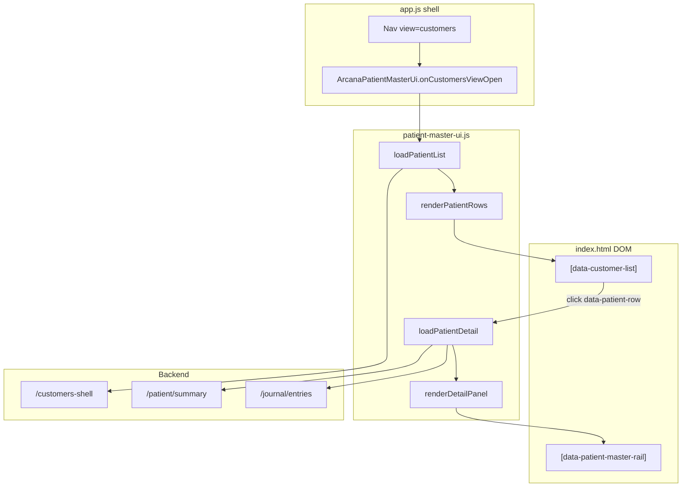

# ORD-15 · Approach 2 audit — v9-design på SPA-data

**Datum:** 2026-06-04  
**Scope:** Audit-only (ingen kod ändrad)  
**Beslut:** Behåll SPA-funktionalitet, applicera v9-design via komponent-rewrite (Approach 2)  
**Källor granskade:**

| System                    | URL / fil                                                              |
| ------------------------- | ---------------------------------------------------------------------- |
| SPA (prod)                | `https://arcana.hairtpclinic.com/major-arcana-preview/?view=customers` |
| v9 mockup (design-target) | `uploads/CCO-Kunder-Mockup-v9-DESKTOP.html`                            |
| v9 experiment (5 %)       | `public/kunder.html` (samma markup/CSS som mockup, deployad separat)   |

---

## Sammanfattning

SPA:s kundvy är **vanilla JS** med **template-string-rendering** och **två parallella kundsystem** i samma DOM:

1. **Patient Master (primär, register-läge)** — `app/patient-master-ui.js` — riktiga patienter, journal, filer, avtal.
2. **Legacy mail-katalog (sekundär, identitet + mail)** — `app.js` — mail-centrerad kundpersistens (`/api/v1/cco/customers/state`).

Approach 2 ska **inte** byta datakälla. Designporten sker genom att byta markup/CSS i befintliga render-funktioner och ev. utöka `index.html`-skelettet — inte genom att flytta till `kunder.html`-experimentet som ny app.

**Största strukturella gap:** v9 mockup har **3-kolumns layout** (segment-meny + tabellista + intel/dossiér), medan SPA har **2-kolumns layout inuti customers-shell** (smal lista vänster, bred dossier höger) utan segment-sidebar och utan tabellkolumner.

---

## 1. Komponent-map

### 1.1 HTML-skelett (statisk)

| Yta                                | Fil                                      | Selektor / element                                                                       |
| ---------------------------------- | ---------------------------------------- | ---------------------------------------------------------------------------------------- |
| Hela kundvyn (shell)               | `public/major-arcana-preview/index.html` | `<section class="customers-shell" data-shell-view="customers">` (~rad 3134)              |
| Header + metrics + toolbar         | samma                                    | `.customers-register-header`, `.customers-metric-row`, `.customers-toolbar`              |
| Lista (container)                  | samma                                    | `<section class="customers-list" data-customer-list>` (~rad 3299)                        |
| Dossier / höger panel (container)  | samma                                    | `<aside class="customers-rail">` → `<section data-patient-master-rail>` (~rad 3303–3307) |
| Identitets-panel (dold i register) | samma                                    | `<div data-patient-identity-rail hidden>` (~rad 3348)                                    |
| Segment/filter UI idag             | samma                                    | `<input data-customer-search>`, `<select data-customer-filter>` (~rad 3271–3294)         |
| Mode-växlare                       | samma                                    | `.patient-master-mode-toggle` → `[data-patient-master-mode="register\|identity"]`        |

### 1.2 Dynamisk rendering — Patient Master (aktiv register-vy)

| Yta                           | Fil                               | Funktion                                                                                         |
| ----------------------------- | --------------------------------- | ------------------------------------------------------------------------------------------------ |
| **Kundlista (rader)**         | `app/patient-master-ui.js`        | `renderPatientRows()` → anropar `renderPatientRowHtml()`                                         |
| Rad-markup                    | samma                             | `renderPatientRowHtml(card, selected)` — `<button class="customer-record" data-patient-row="…">` |
| Virtual scroll (>80 rader)    | `app/cco-patient-list-virtual.js` | `mountVirtualPatientList()` — anropas från `renderPatientRows()`                                 |
| **Dossier / kundkort**        | `app/patient-master-ui.js`        | `renderDetailPanel()` — skriver till `[data-patient-master-rail]`                                |
| Dossier skeleton              | samma                             | `renderDetailLoadingSkeleton()`, `renderDetailEmpty()`, `renderDetailLoadError()`                |
| Dossier lite/shell            | samma                             | `renderDetailShellLite()`, `scheduleFullDetailPanelHydration()`                                  |
| Metrics (5 kort)              | samma                             | `renderMetricCards()` — fyller `[data-patient-metric]`                                           |
| Mode chrome                   | samma                             | `renderModeChrome()`                                                                             |
| Journal-flikar i dossier      | samma                             | `renderPatientPrimaryTabs()`, `renderJournalEntries()`, m.fl.                                    |
| Tidslinje-segment (i dossier) | samma                             | `renderUnifiedTimelinePanel()`, `renderJournalTimelineFilters()`                                 |

### 1.3 Dynamisk rendering — Legacy mail-katalog (app.js)

Används när Patient Master **inte** har register-kontroll (identitets-läge, vissa desktop-idle-laddningar):

| Yta                      | Fil      | Funktion                                                                                                           |
| ------------------------ | -------- | ------------------------------------------------------------------------------------------------------------------ |
| Kundlista                | `app.js` | `renderCustomerRows(visibleKeys)` — `<button data-customer-row="…">`                                               |
| Höger rail-kort (legacy) | `app.js` | `renderCustomerDetailCards()` → `.customers-rail-card`                                                             |
| Metrics (legacy)         | `app.js` | `renderCustomerMetrics()`                                                                                          |
| Merge-grupper            | `app.js` | `renderCustomerMergeGroups()`                                                                                      |
| Filter-orkestrering      | `app.js` | `applyCustomerFilters()` — **returnerar tidigt** om `ArcanaPatientMasterUi.renderStaffAuth()` eller mobil+register |

**Viktigt:** Båda systemen skriver till **samma** `[data-customer-list]`. Patient Master vinner i register-läge via `onCustomersViewOpen()` som körs före legacy idle-load.

### 1.4 Mobil customer-view

| Yta                           | Fil                                                         | Funktion / mekanism                                                                |
| ----------------------------- | ----------------------------------------------------------- | ---------------------------------------------------------------------------------- |
| Shell + bottom nav            | `cco-mobile-shell.js`                                       | `clickNavView("customers")`, `syncFromApp()`, titel från `.patient-master-hero h2` |
| Layout-toggle lista ↔ dossier | `app/patient-master-ui.js`                                  | `syncMobilePatientLayout()` — sätter `html[data-cco-patient-detail="on\|off"]`     |
| Deep link prime               | `app/mobile-deeplink-boot.js`, inline script i `index.html` | `data-cco-patient-detail="on"` + skeleton i rail vid `?patientId=`                 |
| Mobil CSS                     | `cco-mobile-shell.css`, `cco-polish.css`                    | Döljer lista eller rail beroende på `data-cco-patient-detail`                      |
| Back navigation               | `patient-master-ui.js`                                      | `popstate`-handler, `goBackToPatientList()`, `clearMobilePatientSelection()`       |
| Tablet split                  | `adaptive-overrides.css`, `cco-tablet-shell.js/css`         | 768–1023px: grid list+detail                                                       |

**Ingen separat mobilkomponentfil** — samma `renderPatientRows` / `renderDetailPanel`, styrt av CSS-attribut och viewport-detection (`isMobileViewport()`, max-width 768px).

### 1.5 Filter / segment-meny

| UI idag         | Fil                                   | Mekanism                                                                          |
| --------------- | ------------------------------------- | --------------------------------------------------------------------------------- |
| Sökfält         | `index.html` + `patient-master-ui.js` | `[data-customer-search]` → `runtime.query` → debounce 280ms → `loadPatientList()` |
| Filter-dropdown | samma                                 | `[data-customer-filter]` `<select>` → `runtime.flagFilter` → `loadPatientList()`  |
| Flag-mapping    | `patient-master-ui.js` `bindEvents()` | `'behöver granskning'` → `needs_review` + auto `setMode('identity')`              |
| Segment-sidebar | **Finns inte i SPA**                  | Backend stödjer `?segment=` i `customers-shell` — UI anropar det **inte** ännu    |
| v9 filter-chips | mockup only                           | `.customers-filters .filter-chip` — ren mock, ingen API                           |

---

## 2. Render-arkitektur

### 2.1 Stack

| Lager          | Teknik                                                                                               |
| -------------- | ---------------------------------------------------------------------------------------------------- |
| Framework      | **Vanilla JS** (IIFE-moduler). Ingen React/Vue i kundvyn.                                            |
| Web Components | **Lit** används för **mail-kö** (`app/components/arcana-thread-card.js`), **inte** för kundregister. |
| HTML-byggande  | **Template strings** + `element.innerHTML = …` (dominant mönster)                                    |
| DOM-API        | `querySelector`, `classList`, `addEventListener` — event delegation i `bindEvents()`                 |
| Bundling       | `app.bundle.*.min.js` (staff-core split för icke-inbox-vyer) + async `patient-master-ui.js`          |

### 2.2 State management

| Store                      | Plats                                               | Innehåll                                                                                                          |
| -------------------------- | --------------------------------------------------- | ----------------------------------------------------------------------------------------------------------------- |
| **Patient Master runtime** | `patient-master-ui.js` → `const runtime = { … }`    | `patients[]`, `selectedPatientId`, `detail`, `detailTab`, `query`, `flagFilter`, `mode`, loading flags            |
| **Global app state**       | `app.js` → `const state = new Proxy(…)`             | `state.customerRuntime`, `state.selection.customerIdentity`, `state.forms.customerSearch/Filter`, `state.ui.view` |
| **Request cache**          | `app/cco-request-cache.js` → `window.ArcanaCcoData` | Dedupe + staleTime per `cacheKey`                                                                                 |
| **Cache policy**           | `app/cco-cache-policy.js`                           | `PATIENT_LIST`: 2 min stale, `PATIENT_DETAIL`: 90s stale                                                          |

**Ingen central Redux-liknande store för kundvyn.** Patient Master äger register-flödet; app.js äger shell-navigation och legacy mail-katalog.

### 2.3 Re-render-triggers

| Händelse                  | Vad som körs                                                                                                        |
| ------------------------- | ------------------------------------------------------------------------------------------------------------------- |
| Öppna kundvyn             | `app.js` shell switch → `ArcanaPatientMasterUi.onCustomersViewOpen()` → `loadPatientList()` + `renderPatientRows()` |
| Sök/filter                | `runtime.query` / `flagFilter` ändras → `loadPatientList()` → `renderPatientRows()`                                 |
| Klick på rad              | `bindEvents()` → `loadPatientDetail(patientId)` → `loadPatientDetailInternal()` → `renderDetailPanel()`             |
| Flikbyte i dossier        | `switchDetailTab()` / `renderDetailPanel()`                                                                         |
| Mode register ↔ identitet | `setMode()` → `loadPatientList()` eller `loadReviewGroups()` + `renderModeChrome()`                                 |
| Mobil back                | `popstate` / `clearMobilePatientSelection()` → `renderDetailEmpty()` + `renderPatientRows()`                        |
| Legacy (idle)             | `loadCustomersRuntime()` → `applyCustomerFilters()` → `renderCustomerRows()` (kan krocka — se risker)               |

**Ingen diff/reconciler** — full `innerHTML`-ersättning per render-pass (med undantag virtual scroll som återanvänder DOM-noder).

---

## 3. Data-flöde

### 3.1 Backend-endpoints (register-läge)

| Endpoint                                                                              | Anropas från                         | Syfte                                                        |
| ------------------------------------------------------------------------------------- | ------------------------------------ | ------------------------------------------------------------ |
| `GET /api/v1/cco/staff/customers-shell?limit&offset&q&flags`                          | `loadPatientList()`                  | **Primär list-endpoint** — patients + stats + offerTemplates |
| `GET /api/v1/cco-patient-master/stats`                                                | `loadStats()`                        | Metrics (fallback om shell saknar stats)                     |
| `GET /api/v1/cco-patient-master/patient/summary?patientId&includeDriveFiles`          | `fetchPatientDetailFromApi()`        | Snabb dossier (desktop / mobil lite)                         |
| `GET /api/v1/cco-patient-master/patient?patientId&includeDriveFiles&includeJournal=1` | samma                                | Full dossier                                                 |
| `GET /api/v1/cco-journal/entries?patientId&limit=120`                                 | `loadPatientDetailInternal()`        | Journal lazy                                                 |
| `GET /api/v1/cco-commercial/patient-case`, offer/agreement endpoints                  | `loadPatientCommercialCase()`, m.fl. | Avtal/offert-flikar                                          |
| `GET /api/v1/cco-patient-master/review-groups`                                        | `loadReviewGroups()`                 | Identitets-läge                                              |
| `GET/PUT /api/v1/cco/customers/state`                                                 | `app.js` `loadCustomersRuntime()`    | Legacy mail-katalog (ej patient master)                      |

**Backend segment-stöd:** `customers-shell` accepterar `?segment=` och returnerar `segmentStats` (`src/routes/ccoStaff.js`). **Frontend skickar inte segment idag.**

### 3.2 Stores / services

| Modul                               | Roll                                                                       |
| ----------------------------------- | -------------------------------------------------------------------------- |
| `ArcanaCcoData` / `CcoRequestCache` | Fetch dedupe, staleTime, cacheKey-invalidering                             |
| `ArcanaCcoPatientListVirtual`       | Virtual scroll för listor >80                                              |
| `ArcanaMobileShell`                 | Mobil navigation sync                                                      |
| `ArcanaPostOpInternalReviews`       | Omdömen-knapp i header                                                     |
| Diverse journal-form modules        | `journal-tp-form.js`, `journal-prp-form.js`, m.fl. — mountas inuti dossier |

### 3.3 Caching

```text
List:  cacheKey = `customers-shell:list:${query}:${flagFilter}:${offset}`
       staleTime = PATIENT_LIST (2 min)

Detail: cacheKey = `patient-detail:${patientId}:${full|summary}:${driveQuery}`
        staleTime = PATIENT_DETAIL (90 s)

Prefetch: pointerdown på rad → fetchPatientDetailFromApi(includeDriveFiles:false)
          sparas i window.__ARCANA_PATIENT_PREFETCH__
```

Server-side: `ccoReadCache` TTL ~120s för segment-stats i `customers-shell`.

### 3.4 Klick på kundrad — exakt kodväg

```text
1. pointerdown [data-patient-row]
   → prefetchPatientDetailIntent(patientId)     [patient-master-ui.js:5558]

2. click [data-patient-row] (register mode)
   → loadPatientDetail(patientId)               [patient-master-ui.js:5594]
   → loadPatientDetailInternal(patientId)         [patient-master-ui.js:4598]
      a. runtime.selectedPatientId = patientId
      b. updatePatientRowSelection() ELLER renderPatientRows()
      c. renderDetailLoadingSkeleton()
      d. syncMobilePatientLayout() → data-cco-patient-detail=on (mobil)
      e. pushMobilePatientDetailHistory() (mobil)
      f. resolvePatientDetailPayload() → API summary/full
      g. renderDetailPanel() ELLER renderDetailShellLite() → scheduleFullDetailPanelHydration()
      h. Parallellt: journal, commercial case, agreement, draft proposals
```

Legacy-väg (sällan aktiv i register): `app.js` click `[data-customer-row]` → `setSelectedCustomerIdentity()`.

---

## 4. CSS-arkitektur

### 4.1 Filer som styr customer-view

| Fil                                       | Roll                                                                                                     |
| ----------------------------------------- | -------------------------------------------------------------------------------------------------------- |
| `design-tokens.css`                       | Globala CSS-variabler, `@layer`-intention                                                                |
| `legacy-styles-loader.css` → `styles.css` | Legacy v3–v5 (stor kaskad, många `!important`)                                                           |
| `adaptive-tokens.css`                     | Adaptive spacing/radius tokens                                                                           |
| **`adaptive-overrides.css`**              | Responsiva overrides **utan** att röra app.js — se 4.4                                                   |
| **`cco-polish.css`**                      | **Primär customer-view styling** — `.customers-*`, `.customer-record*`, `.patient-master-*` (~rad 4279+) |
| `cco-mobile-shell.css`                    | Mobil bottom nav + patient-detail layout                                                                 |
| `cco-tablet-shell.css`                    | Tablet-specifika justeringar                                                                             |
| `cco-scalp-analysis.css`                  | Scalp-flik (feature-flag)                                                                                |

`public/kunder.html` / mockup: **all CSS inline** i `<style>` — separat token-block, ej kopplat till SPA cascade.

### 4.2 Class-namnschema

| Prefix             | Användning                                        |
| ------------------ | ------------------------------------------------- |
| `customers-*`      | Shell, layout, toolbar, utility buttons           |
| `customer-record*` | Listrader (både patient master och legacy)        |
| `patient-master-*` | Dossier, journal, tabs, segments i detaljvy       |
| `focus-customer-*` | Hero/header i dossier (delad med inbox focus-yta) |
| `warm-*`           | Mail-kö (ej kundlista)                            |

**Inte strikt BEM.** Hybrid: semantiska block (`customers-layout`) + tillstånd (`.is-selected`, `.is-active`) + utility-liknande modifiers (`--compact`, `--gold`).

### 4.3 Mobil vs desktop

| Mekanism             | Detalj                                                                                                                     |
| -------------------- | -------------------------------------------------------------------------------------------------------------------------- |
| Media queries        | `@media (max-width: 767px)`, `(max-width: 1100px)`, `(min-width: 1024px)` i `cco-polish.css`                               |
| JS viewport          | `matchMedia('(max-width: 768px)')` i patient-master-ui; `data-cco-mobile-shell="on"` på `<html>` via `cco-mobile-shell.js` |
| Layout switch        | `html[data-cco-patient-detail="on"]` — mobil: visa rail, dölj lista+toolbar                                                |
| Tablet               | `html[data-cco-tablet-shell='on']` + adaptive split grid 320px + 1fr                                                       |
| Separata komponenter | **Nej** — samma markup, CSS styr synlighet                                                                                 |

**Nuvarande desktop layout (SPA):**

```css
.customers-layout {
  grid-template-columns: minmax(220px, 260px) minmax(0, 1fr);
}
/* Smal lista vänster · bred dossier höger */
```

**v9 desktop layout:**

```css
.app-grid {
  grid-template-columns: 200px minmax(0, 1fr) 360px;
}
/* Segment · tabellista · intel/dossiér */
```

### 4.4 Vad gör `adaptive-overrides.css`?

Filen är en **skin-/layout-lager ovanpå befintliga vyer** utan att ändra `app.js`:

- Modaler → bottom sheets på mobil (`.customers-modal-surface`)
- Tabeller → scroll/card-list fallback
- `.preview-workspace` single-column på mobil
- Queue/filter chip wrap (mail, inte kund-chips)
- Tablet split view for customers (`section[data-shell-view="customers"]` grid 320px + 1fr)
- QA: ÅÄÖ overflow, min touch targets 44px, no horizontal scroll

**Den implementerar inte v9-design** — den löser adaptiva layout-buggar. v9-tokens (panel-shell gradients, dossier-stats) finns **inte** här.

---

## 5. Mockup-diff — 10 största strukturella skillnader

| #   | Område                 | SPA idag                                                            | v9 mockup vill ha                                                                       | Portning                                                                                                       |
| --- | ---------------------- | ------------------------------------------------------------------- | --------------------------------------------------------------------------------------- | -------------------------------------------------------------------------------------------------------------- |
| 1   | **Grid-topologi**      | 2-kol inuti shell: smal lista + bred rail                           | 3-kol: `side-shell` + center list + `intel-shell`                                       | **Svår** — kräver HTML-skelett + layout-omkoppling; dossier flyttas till tredje kolumn                         |
| 2   | **Listpresentation**   | Vertikala `<button.customer-record>` kort, ~3 rader text            | Tabell med header (`customer-row-head`) + 7 kolumner inkl. AI nästa-steg                | **Medel** — `renderPatientRowHtml()` → tabell-rad; virtual scroll måste anpassas                               |
| 3   | **Segment-navigering** | `<select>` filter + 5 metric-kort                                   | Vänster `side-shell` med segment (Alla, Mina, Idag, VIP, Risk…) + counts                | **Medel** — UI nytt; API `segment` finns redan i backend                                                       |
| 4   | **Filter-chips**       | Dropdown (Cliento/Drive/granska…)                                   | Horisontella `.filter-chip` med counts + sort-dropdown                                  | **Enkel–Medel** — markup + koppla till `flagFilter`/`segment`                                                  |
| 5   | **Toolbar / header**   | `h1 Kundregister` + mode toggle + utility-knappar                   | `calendar-toolbar`-stil: kicker, ikon, "1 247 kunder", Exportera/Ny kund                | **Enkel** — mest CSS + header-omskrivning                                                                      |
| 6   | **Status / metrics**   | 5 färgade metric-kort (migration-fokus)                             | `calendar-status-bar` pills + `agg-insights` AI-kort (4 st)                             | **Medel** — ny markup; AI-kort kräver data-beslut (mock vs riktig)                                             |
| 7   | **Höger panel (idle)** | Tom rail / "Välj en kund"                                           | `intel-shell` med population-agg, chart, AI-lista                                       | **Svår** — ny panel + endpoints; mockup-data finns inte i SPA                                                  |
| 8   | **Dossier-struktur**   | Flikbaserad: Profil/Journal/Tidslinje/Avtal/Filer + inline formulär | `dossier-*`: collapsible `<details>` sektioner (bokningar, filer, notes, comm, economy) | **Svår** — informationsarkitektur skiljer sig; måste mappa befintliga flikar → sektioner utan funktionsförlust |
| 9   | **Dossier stats**      | Hero chips + identity card                                          | `dossier-stats` grid (LTV, besök, no-shows…) med trend                                  | **Medel** — delvis data finns i `card`/`commercialCase`; resten saknas                                         |
| 10  | **Visuellt språk**     | `cco-polish` warm cards, 0.7rem radius, ljus border                 | v9 panel-shell gradients, 22px radius, neumorphic shadow, 13px Inter                    | **Enkel–Medel** — token/port i `design-tokens.css` + `cco-polish.css` eller ny `@layer v9`                     |

### Portningssvårighet — snabb ranking

| Enklast (visuell pay-off / låg risk)            | Svårast (funktion + layout)                    |
| ----------------------------------------------- | ---------------------------------------------- |
| Toolbar + status pills (5)                      | 3-kolumns grid + intel idle panel (1, 7)       |
| Token/shadow/radius (10)                        | Dossier IA: flikar → details-sektioner (8)     |
| Filter-chips kopplade till befintliga flags (4) | Tabellista + virtual scroll (2)                |
| Segment-sidebar med backend segment (3)         | AI aggregate insights — data + godkännande (6) |

---

## 6. Porterings-strategi (förslag)

### 6.1 Var börja?

**Steg 0 (foundation):** v9 design tokens som CSS-variabler i `design-tokens.css` (panel-shell, status-pills, rose-pill) — påverkar hela vyn utan att röra data.

**Steg 1 (störst visuell pay-off):** Toolbar + status bar — byt `.customers-register-header` / `.customers-metric-row` till v9 `.calendar-toolbar` + `.calendar-status-bar` **behåll samma data** från `renderMetricCards()` / `runtime.stats`.

**Steg 2:** Listrader — behåll `data-patient-row` och klick-handler; byt bara `renderPatientRowHtml()` markup/CSS mot v9 `.customer-row` (kan börja utan alla kolumner).

### 6.2 Commit-ordning (iterativ, 8 steg)

| Steg | Leverans                                                               | Berörda filer                                                         | Estimat |
| ---- | ---------------------------------------------------------------------- | --------------------------------------------------------------------- | ------- |
| 1    | v9 tokens + page background gradient                                   | `design-tokens.css`, ev. `adaptive-tokens.css`                        | 0.5–1 d |
| 2    | Toolbar + status pills (data från stats)                               | `index.html`, `cco-polish.css`, `renderMetricCards()`                 | 1–2 d   |
| 3    | Filter-chips UI (koppla `flagFilter`, behåll select som fallback)      | `index.html`, `patient-master-ui.js`, CSS                             | 1–2 d   |
| 4    | Listrad v9 (enkel rad, inte full tabell ännu)                          | `renderPatientRowHtml()`, CSS                                         | 1–2 d   |
| 5    | Tabell-header + kolumner (kontakt, status, LTV)                        | `renderPatientRows()`, virtual scroll test                            | 2–3 d   |
| 6    | Segment-sidebar + `?segment=` i `loadPatientList()`                    | `index.html`, `patient-master-ui.js`, `ccoStaff.js` (ev. nya segment) | 2–4 d   |
| 7    | 3-kolumns layout (segment \| list \| rail)                             | `index.html`, `cco-polish.css`, mobil/tablet breakpoints              | 3–5 d   |
| 8    | Dossier v9 skin (hero + details-sektioner, behåll flikar som fallback) | `renderDetailPanel()`, CSS                                            | 5–8 d   |

**Total grov estimat:** 16–27 arbetsdagar för desktop-paritet (exkl. AI intel-panel och mock-only features).

### 6.3 Risker

| Risk                        | Beskrivning                                                                | Mitigering                                                                         |
| --------------------------- | -------------------------------------------------------------------------- | ---------------------------------------------------------------------------------- |
| **Dual render system**      | Legacy `applyCustomerFilters()` kan skriva över listan efter idle callback | Guard: skip legacy render när `ArcanaPatientMasterUi` register mode (även desktop) |
| **innerHTML re-render**     | Full dossier-refresh vid varje flikbyte → scroll/focus loss                | Incremental DOM eller section partials i steg 8                                    |
| **Virtual scroll + tabell** | `cco-patient-list-virtual.js` antar kompakta rader                         | Testa row height; ev. höj threshold                                                |
| **Mobil 2-state**           | v9 mockup är desktop-first; mobil behöver eget flöde                       | Behåll `data-cco-patient-detail`; portea v9 skin inuti befintlig mobil CSS         |
| **Segment/API gap**         | Mockup segment (VIP, Dormant, LTV…) matchar inte alla backend-segment      | Mapping-dokument + owner-beslut innan steg 6                                       |
| **AI/mock features**        | agg-insights, AI nästa-steg, intel chart — ingen prod-data                 | Feature-flag eller placeholder; ej blockera steg 1–5                               |
| **Performance**             | 3-kol + tyngre DOM                                                         | Behåll virtual scroll; lazy dossier (redan summary-first)                          |

---

## 7. Öppna frågor (owner-beslut innan kod)

### Layout & IA

1. **Ska SPA få v9:s 3-kolumns layout** (segment | lista | dossier/intel), eller ska v9 anpassas till nuvarande 2-kol (lista | dossier) inuti befintlig shell?
2. **Intel-panel i vila:** Ska höger kolumn visa population-agg (som mockup) när ingen kund är vald — och ska det bygga på riktig analytics eller vara fas 2?
3. **Dossier:** Flik-modell (Profil/Journal/…) vs v9 `<details>`-sektioner — full ersättning eller hybrid?

### Data & segment

4. **Segment-meny:** Vilka segment ska vara prod-ready? Backend har `filterPatientsBySegment` — vilka IDs mappar till mockup ("VIP", "Dormant", "Mina kunder")?
5. **AI-kolumner** ("AI nästa-steg", agg-insights): Riktig CCO-agent-data, manuella regler, eller dölja tills agent P0?
6. **LTV / intäkt i lista:** Finns godkänd källa i `commercialCase`/Fortnox — eller ska kolumnen vänta?

### Teknik & scope

7. **Legacy mail-katalog:** Ska `app.js` customer render tas bort/guardas hårdare när Approach 2 startar?
8. **`kunder.html`-experiment:** Arkiveras det när SPA portats, eller lever kvar som referens?
9. **Brand:** Hair TP vs Curatiio — ska v9 rose/accent gälla båda tenants?
10. **Mobil/tablet:** Ska v9-design gälla mobil i samma pass, eller desktop-first med mobil i separat fas (rekommenderat)?

### Godkännande

11. **Acceptanskriterier:** Pixel-paritet mot mockup, eller "samma data + v9 rhythm/spacing" (Major Arcana token-regler)?
12. **Pilot:** Patient-lista pilot-filter (`filterPilotPatients`) — ska v9-porten respektera samma begränsning?

---

## Bilaga A — Filreferenser (snabbnavigering)

```text
index.html          customers-shell skelett, data-* hooks
app/patient-master-ui.js   register list + dossier (primär)
app.js              shell nav, legacy customer directory
cco-polish.css      customer-view styles (~4279+)
cco-mobile-shell.js + .css   mobil layout
adaptive-overrides.css       responsive patches (ej v9 skin)
uploads/CCO-Kunder-Mockup-v9-DESKTOP.html   design target
src/routes/ccoStaff.js   GET customers-shell
```

## Bilaga B — Arkitekturdiagram (nuvarande SPA)



---

## 8. Owner-beslut (2026-06-04) — låser implementation

| #   | Beslut                                                                                                               | Konsekvens                                                                                                                                                          |
| --- | -------------------------------------------------------------------------------------------------------------------- | ------------------------------------------------------------------------------------------------------------------------------------------------------------------- |
| 1   | **Build:** `bin/build-bundle.js` (custom Node concat) · `npm run build:bundle` efter JS som påverkar bundle-manifest | `app.js` m.fl. i manifest → rebuild + hash i `index.html`. `patient-master-ui.js` laddas async utanför bundle — rebuild **inte** alltid nödvändig; se ORD-16 steg 1 |
| 2   | **Branch:** `main` direkt                                                                                            | Inga feature-brancher för v9-port; commit per steg på main                                                                                                          |
| 3   | **Deploy:** Iterativ — **ett commit per steg**                                                                       | Prod får stegvis v9; flag off = ingen synlig förändring                                                                                                             |
| 4   | **Mobile + desktop:** Båda **parallellt per komponent**                                                              | Varje steg levererar CSS/JS för 320px + 1024px+ innan nästa steg                                                                                                    |
| 5   | **Backward-compat:** Feature-flag `?v9=on` → `localStorage arcana.v9.enabled` · default **off**                      | `html[data-v9-enabled="on"]` aktiverar v9-markup/CSS; prod oförändrad tills flag                                                                                    |
| 6   | **`/kunder.html`:** Porta **5 %** (agg-cards + Smart Nästa Steg + watch-widget) till SPA · **sen radera**            | Källkod: `public/kunder.html`, `public/cco-kunder-real.js`, `public/cco-kunder-smart-next-step.js` — **inte** steg 1                                                |

### Beslut som stänger öppna frågor (§7)

| Tidigare fråga      | Beslut                                                                |
| ------------------- | --------------------------------------------------------------------- |
| Mobil scope (§7.10) | Parallellt med desktop per komponent                                  |
| kunder.html (§7.8)  | Porta 5 % → radera experimentfil                                      |
| Acceptans (§7.11)   | Major Arcana rhythm/spacing + samma SPA-data; pixel-paritet sekundärt |
| Legacy guard (§7.7) | Ja — guarda `applyCustomerFilters()` när v9 flag on (ORD-16 steg 2+)  |

---

## 9. Jämförelse audit-rapporter (Cursor ↔ Claude)

| Rapport | Fil                                             | Status                 |
| ------- | ----------------------------------------------- | ---------------------- |
| Cursor  | `ORD-15-spa-v9-port-audit-2026-06-04.md`        | ✅                     |
| Claude  | `ORD-15-CLAUDE-AUDIT-SPA-V9-PORT-2026-06-04.md` | ✅ (pushad 2026-06-04) |

### Överens — kanonisk bas för ORD-16+

| Tema              | Gemensam slutsats                                                                              |
| ----------------- | ---------------------------------------------------------------------------------------------- |
| Primär kärna      | `app/patient-master-ui.js` — lista + dossier + tabs                                            |
| Virtual scroll    | `app/cco-patient-list-virtual.js`, `PAGE_SIZE = 60`                                            |
| CSS skin-mönster  | `adaptive-overrides.css` + tokens — ny v9-CSS ska scopas, inte ersätta legacy                  |
| Mobil/desktop     | Separata shell-filer; båda måste följa med per komponent (owner §8.4)                          |
| Mockup-diff       | Segment-sidebar, filter-chips, agg-cards, tabellista, intel/dossiér, watch-widget saknas i SPA |
| Porteringsprincip | **Behåll logik + data — skriv om templates/markup**                                            |
| Build             | `bin/build-bundle.js` / `npm run build:bundle` för bundle-manifest-filer                       |

### Avvikelser — Cursor korrigerar / kompletterar Claude

| #   | Claude                                            | Cursor (verifierat i repo)                                                                                                | Påverkan ORD-16                                                               |
| --- | ------------------------------------------------- | ------------------------------------------------------------------------------------------------------------------------- | ----------------------------------------------------------------------------- |
| 1   | Kundvy = **lit-html** templates                   | **Template strings + `innerHTML`** i `patient-master-ui.js`. Lit = mail-kö (`arcana-thread-card.js`), inte register-lista | Portering = JS string-templates, inte `html\`...\``                           |
| 2   | Saknar **dual system**                            | `app.js` legacy (`renderCustomerRows`, `/api/v1/cco/customers/state`) delar `[data-customer-list]`                        | Guard legacy när v9 flag on (steg 2+)                                         |
| 3   | List-API: bara `/cco-patient-master/*`            | Primär lista: **`GET /api/v1/cco/staff/customers-shell`**                                                                 | Segment/agg måste kopplas hit, inte bara patient-master CRUD                  |
| 4   | Filter: "sannolikt chips i patient-master-ui"     | Idag **`<select data-customer-filter>`** + metrics — inga v9-chips                                                        | Steg 3 = ny markup, befintlig `flagFilter`                                    |
| 5   | Klick rad → "antagligen tabs"                     | Exakt: `loadPatientDetail` → `renderDetailPanel()` (+ prefetch på pointerdown)                                            | Behåll handlers; byt bara HTML i `renderPatientRowHtml` / `renderDetailPanel` |
| 6   | Re-render via **`scheduleRender`**                | Patient Master: **direkt render-funktioner** efter async fetch; `scheduleRender` = inbox/app.js                           | Testa state-triggers per funktion, inte ett globalt render(state)             |
| 7   | Claude steg 1 = **layout-shell** (nav + sidomeny) | Owner + ORD-16 steg 1 = **feature-flag + scoped tokens** (default off)                                                    | **Owner beslutar** — Claude §6 steg 1 skjuts till steg 2+                     |
| 8   | Claude §7 öppna frågor                            | **Stängda** i owner §8 (main, iterativ deploy, flag, kunder.html)                                                         | Ingen blocker                                                                 |

### Claude tillägg värda att behålla

| Tillägg                                                                       | Källa                                                             |
| ----------------------------------------------------------------------------- | ----------------------------------------------------------------- |
| `app/cco-care-panel.js` — care/komm i dossier                                 | Claude §1                                                         |
| Mail i dossier: `thread-store.js`, `thread-store-bridge.js`                   | Claude §1                                                         |
| Dossier sub-komponenter (`renderPatientComplianceCard`, hero, tabs radnummer) | Claude §1 — alignar med Cursor `renderDetailPanel()`              |
| CSS-scoping / BEM-prefix som risk                                             | Claude §6 — motiverar `[data-v9-enabled="on"]` + `cco-v9-*` filer |

### Mockup-diff — rad-för-rad

Claude §5 och Cursor §5 **överens** på alla 10 punkter (top-nav, sidomeny, header, chips, agg, rad, dossier, intel default, watch, mobil). Cursor tillägger **2-kol vs 3-kol grid** som strukturell skillnad.

### Porteringsordning — reconciled roadmap

| Claude steg       | ORD-16 (owner-adjusted)                                 |
| ----------------- | ------------------------------------------------------- |
| —                 | **Steg 1:** feature-flag + scoped tokens ✅ GO          |
| 1 layout-shell    | **Steg 2:** toolbar + status pills                      |
| 2 list-rad        | **Steg 4:** `renderPatientRowHtml` v9                   |
| 3 filter-chips    | **Steg 3**                                              |
| 4 sidomeny        | **Steg 6:** segment (`cco-kunder-real.js` `SEGMENT_UI`) |
| 5 agg-cards       | **Steg 9** (med smart-next + watch — owner 5 %)         |
| 6–8 dossier       | **Steg 7–8**                                            |
| 9 aggregat-vy     | **Steg 7** (3-kol beslut pending)                       |
| 10 watch + mobile | **Steg 9–10**                                           |

**Tidsuppskattning:** Claude 8–12 d · Cursor 16–27 d — skillnad p.g.a. Claude räknar template-rewrite snabbare; Cursor inkluderar dual-system guard + segment API + virtual-scroll QA.

**Nästa dokument:** [`ORD-16-spa-v9-step-1-plan-2026-06-04.md`](./ORD-16-spa-v9-step-1-plan-2026-06-04.md) — **steg 1 implementeras på main.**

---

_Audit utförd 2026-06-04 · uppdaterad med owner-beslut samma dag · Approach 2 · audit-only (kod i steg 1+ enligt ORD-16)._
