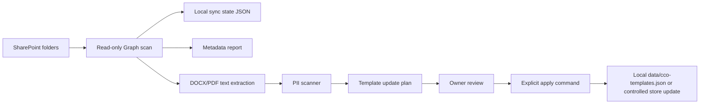

# SharePoint Template Sync Project

Status: proposal / separate project  
Created: 2026-06-24  
Owner: Codex + Cloud Code, after explicit credential handoff  
Scope: Microsoft 365 SharePoint template/source sync, not runtime UI work

## Why This Exists

SharePoint is currently treated as an archive/facit for Word/PDF source documents. The repo already has:

- `docs/strategy/SHAREPOINT-TEMPLATE-INVENTORY.md` — metadata inventory from SharePoint.
- `docs/strategy/SHAREPOINT-IMPORT-REPORT-2026-05-30.md` — previous one-off import into local `data/cco-templates.json`.
- `docs/migration/sharepoint-manifest.json` — mapping from known SharePoint source files to GitHub implementations.
- `scripts/sync-sharepoint-archive.sh` — archive sync from GitHub to `MA-Archive/sharepoint`, not a live SharePoint download.

This project defines the next step: a controlled, read-only SharePoint sync pipeline that can detect source changes and prepare safe template updates without putting credentials, patient data, or raw Word originals in GitHub.

## Non-Goals

- Do not build from iCloud.
- Do not commit SharePoint credentials, access tokens, raw DOCX/PDF originals, patient data, or extracted full template text to GitHub.
- Do not auto-write into production template stores.
- Do not change CCO runtime routes or UI until the sync pipeline has passed dry-run and owner review.
- Do not replace GitHub as source of truth for runtime code/specs. SharePoint remains source/archive for original business documents.

## Required Inputs

The project cannot run live until these are provided outside GitHub:

| Input                          | Example / current clue                                                                          | Required |
| ------------------------------ | ----------------------------------------------------------------------------------------------- | -------- |
| Tenant ID                      | Existing Graph tenant env may already exist for mail                                            | yes      |
| Client ID                      | Azure app registration with Microsoft Graph app permissions                                     | yes      |
| Client secret or certificate   | Secret manager / local env only                                                                 | yes      |
| SharePoint hostname            | `hairtpclinic1.sharepoint.com`                                                                  | yes      |
| Site path                      | `/sites/Ledning`                                                                                | yes      |
| Drive ID                       | Existing report references `b!J9ysU7x080-442YSpY3ck-umNLLDGMRNtOxNUKIJiFmCSMH3wxTSTYHwSsJ7Gy2C` | yes      |
| Folder allowlist               | Start from `docs/strategy/SHAREPOINT-TEMPLATE-INVENTORY.md`                                     | yes      |
| Owner approval for import mode | dry-run only, then apply by explicit command                                                    | yes      |

Proposed env names:

```bash
ARCANA_SHAREPOINT_SYNC_ENABLED=false
ARCANA_SHAREPOINT_TENANT_ID=
ARCANA_SHAREPOINT_CLIENT_ID=
ARCANA_SHAREPOINT_CLIENT_SECRET=
ARCANA_SHAREPOINT_HOSTNAME=hairtpclinic1.sharepoint.com
ARCANA_SHAREPOINT_SITE_PATH=/sites/Ledning
ARCANA_SHAREPOINT_DRIVE_ID=
ARCANA_SHAREPOINT_FOLDER_ALLOWLIST_JSON=
ARCANA_SHAREPOINT_STATE_PATH=./data/sharepoint-template-sync-state.json
ARCANA_SHAREPOINT_REPORT_PATH=./data/reports/sharepoint-template-sync-latest.json
```

## Permissions

Preferred Microsoft Graph permissions:

- `Sites.Selected` if the tenant can grant per-site access.
- Otherwise a narrowly reviewed read-only application permission such as `Sites.Read.All`, approved by owner.

The app must not request write permissions for phase 1-3.

## Data Flow



## Phases

### Phase 0 — Prep

- Confirm credentials and site/drive access outside the repo.
- Freeze folder allowlist from the existing inventory.
- Confirm that SharePoint originals are not copied into GitHub.

Acceptance:

- `GET /sites/{hostname}:/sites/Ledning` works with the app.
- `GET /drives/{driveId}/root` works.
- No secret is printed in logs.

### Phase 1 — Inventory Refresh

Build a script that:

- Lists allowlisted folders recursively.
- Records metadata only: file name, item ID, drive ID, parent path, MIME/type, size, `lastModifiedDateTime`, web URL, content hash if available.
- Writes a JSON report under `data/reports/` and a markdown summary under `docs/strategy/` only if it contains no PII or full source text.

Acceptance:

- Counts match or intentionally supersede `SHAREPOINT-TEMPLATE-INVENTORY.md`.
- Deleted/moved/renamed files are explicitly reported.
- Report contains metadata only.

### Phase 2 — Extraction Dry-Run

Build a dry-run extractor for template candidates:

- DOCX: parse text locally from downloaded bytes in temp storage.
- PDF: parse text only for known production template PDFs.
- Run PII scanner before any store update plan is generated.
- Output only text hashes, byte counts, candidate template IDs, and diff summaries.

Acceptance:

- Full text is not committed.
- PII scanner result is clean or blocks the run.
- Multi-section DOCX issue from `SHAREPOINT-IMPORT-REPORT-2026-05-30.md` is handled by raw download + DOCX parsing, not Graph `read_resource` text snippets.

### Phase 3 — Template Update Plan

Generate a reviewable plan:

- `templateId`
- source SharePoint item ID
- old version/new proposed version
- old/new hash prefix
- legal priority class: Nordbro, production PDF, internal 2026, staging/fallback
- reason: new, update, duplicate, skip, needs manual review

Acceptance:

- No apply step runs automatically.
- Nordbro and production PDFs keep priority over internal working copies.
- Duplicates are preserved as metadata, not imported as separate active templates.

### Phase 4 — Apply With Explicit Approval

Apply only after owner says exactly which plan file to apply.

Acceptance:

- Atomic write.
- Revision entry for every changed template.
- Backup before write.
- Post-apply report with hashes and changed IDs.

### Phase 5 — Optional Watcher

Only after phases 1-4 are stable:

- Add a scheduled dry-run watcher for SharePoint `lastModifiedDateTime`.
- Notify/report only.
- No automatic apply.

## Existing Source Priority Rules

1. Nordbro legal files in `97. Versioner från advokat/`.
2. Production PDFs in `0. NY Tjänstespecifikationer PDF/`.
3. Brand 2026 DOCX working copies.
4. Mail templates in `98. Mailmallar/`.
5. Fazli staging/consolidated folder only as manual-review fallback.
6. Old Kundresan/Insatt versions stay legacy unless owner explicitly promotes them.

## First Implementation PR Should Include

- `scripts/sharepoint-template-sync-dry-run.js`
- `tests/scripts/sharepointTemplateSyncDryRun.test.js`
- `docs/strategy/SHAREPOINT-TEMPLATE-SYNC-DRY-RUN-YYYY-MM-DD.md` generated from fixture only
- No production secrets, no real downloaded originals, no runtime server route changes

## Open Questions

1. Should this use the existing Graph app registration or a separate SharePoint-only app?
2. Can the tenant grant `Sites.Selected` for `hairtpclinic1.sharepoint.com/sites/Ledning`?
3. Which folder list is approved for phase 1: the full inventory or only production template folders?
4. Should `data/cco-templates.json` remain the apply target, or should templates move into a dedicated versioned store before the next import?
5. Who approves legal priority conflicts when Nordbro and internal 2026 files disagree?

## Immediate Next Step

Do not write code until credentials and folder allowlist are confirmed. The safe next commit after this document is a fixture-only dry-run scaffold that proves parsing, PII scan, and report formatting without touching live SharePoint.
