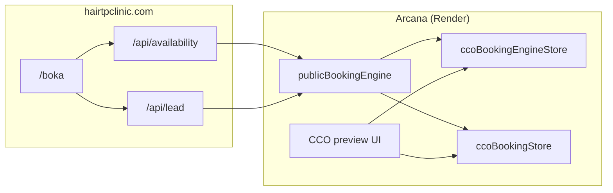

# CCO Booking — MVP-specifikation

Status: **UTKAST (godkänd för Sprint 0)**  
Datum: 2026-05-22  
Tenant-pilot: **Hair TP Clinic**

Relaterat:

- **[cco-booking-plan-a-go-live.md](./cco-booking-plan-a-go-live.md)** — **Plan A scope (online möte, fysisk konsultation, uppföljning HT)**
- [cco-booking-sprint-0-checklist.md](./cco-booking-sprint-0-checklist.md) — operativ aktivering (1–2 veckor)
- [web-to-arcana-bridge.md](./web-to-arcana-bridge.md) — API-kontrakt webb ↔ Arcana
- [cco-booking-phone-booking-level-1_5-plan.md](./cco-booking-phone-booking-level-1_5-plan.md) — operatörsflöde telefon
- [cco-booking-prod-readiness-checklist.md](./cco-booking-prod-readiness-checklist.md) — gates innan live
- [cco-patient-journal-build-plan.md](./cco-patient-journal-build-plan.md) — Fas 6.3 journalkoppling
- Benchmark-underlag (ej duplicerat): [`../../CCO Booking/`](../../CCO%20Booking/) — `CCO_Booking_benchmark_och_funktionslista.txt`, `CCO_Booking_benchmark_kravlista.txt`

---

## 1. Executive summary

CCO Booking ska låta **patienter boka online** på hairtpclinic.com medan **personal hanterar, bekräftar och följer upp i CCO** — utan Cliento som långsiktig bokningsmotor.

**Plan A (go-live scope):** endast tre mötestyper — **online möte**, **fysisk konsultation**, **uppföljning hårtransplantation**. Se [Plan A](./cco-booking-plan-a-go-live.md).

MVP Fas 1 fokuserar på **Plan A:s tre tjänster**, **en kanal (webb → CCO)**, och **tydlig operatörsbekräftelse** (reservation ≠ slutgiltig bokning). Det som redan finns i kodbasen (booking-engine, publika endpoints, Resend-mallar, CCO booking-case) aktiveras och verifieras end-to-end — inte byggs om från scratch.

CCO:s differentiator mot Bokadirekt/Timma är inte en snygg kalender i sig, utan **bokning som första steg i kundresan**: journal, offerter, avtal, eftervård och agentstöd i samma operativa system.

---

## 2. Produktpositionering

### 2.1 Jämförelse mot marknaden

| Dimension                | Bokadirekt / Timma              | CCO Booking (målbild)                                  |
| ------------------------ | ------------------------------- | ------------------------------------------------------ |
| Kärnuppgift              | Kalender + kundregister         | Kundresa från första kontakt till uppföljning          |
| Publik bokning           | Stark, enkel, mobil             | Ja — via egen sajt, inte marknadsplats                 |
| Personalvy               | Kalender, kundhistorik          | CCO workspace: bokning + mail + journal + kommersiellt |
| Påminnelser              | SMS/e-post standard             | Fas 2+ (scheduler + mallar)                            |
| Betalning / deposition   | Inbyggt                         | Fas 2 (koppling till commercial)                       |
| Journal / avtal / offert | Begränsat eller externa verktyg | **Inbyggt i Arcana** — huvuddifferentiator             |
| Agentstöd                | Saknas                          | CCO-agent flaggar saknade steg (Fas 3)                 |

### 2.2 Vad vi tar från benchmark (prioriterat)

Från Bokadirekt/Timma (se benchmark-filer ovan):

- Enkel mobilbokning, tydlig behandlingslista, nästa lediga tid
- Bokningsbekräftelse och påminnelser
- Personalschema och intern bokning

Det CCO går längre med (Fas 2–3):

- Bokning → behandlingstillfälle → journal (Fas 6.3)
- Blockering om samtycke/avtal saknas före behandling
- Operatörs- och agentstöd kring hela resan, inte bara tiden i kalendern

### 2.3 Strategiskt beslut (låst)

| Beslut                                                   | Källa                                                           |
| -------------------------------------------------------- | --------------------------------------------------------------- |
| Cliento fasas ut som webb-bokningsmotor                  | [web-to-arcana-bridge.md](./web-to-arcana-bridge.md) §1         |
| Webben äger intention; Arcana äger sanning               | Bridge §0                                                       |
| Reservation ≠ bekräftad bokning tills operatör confirmar | [level 1.5-plan](./cco-booking-phone-booking-level-1_5-plan.md) |

---

## 3. Nuvarande läge i kodbasen

### 3.1 Det som finns

| Komponent                                                        | Fil / API                                                                                 | Status                        |
| ---------------------------------------------------------------- | ----------------------------------------------------------------------------------------- | ----------------------------- |
| Booking-engine store (resurser, tjänster, schema, reservationer) | `src/ops/ccoBookingEngineStore.js`                                                        | Byggd, Hair TP-data seedad    |
| Intern booking-engine API (auth)                                 | `src/routes/ccoBookingEngine.js` — `/api/v1/cco-booking-engine/*`                         | Byggd                         |
| Publika read/write endpoints (webb)                              | `src/routes/publicBookingEngine.js` — catalog, availability, **reservations**             | Byggd (Fas B + C)             |
| CCO booking-case (ärende, kandidater, audit)                     | `src/ops/ccoBookingStore.js`, `src/routes/ccoBookings.js`                                 | Byggd                         |
| CCO UI — booking surface + engine-flöde                          | `public/major-arcana-preview/app.js`                                                      | Byggd                         |
| Resend-bekräftelse + operatörsnotis                              | `src/templates/bookingReservationEmail.js`, `src/infra/resendMailer.js`                   | Byggd (mock utan API-nyckel)  |
| Patient360-synk från booking-case                                | `src/ops/ccoPatient360Bridge.js` → `syncPatient360FromBookingCase`                        | Delvis                        |
| Webb-bridge kontrakt                                             | `docs/strategy/web-to-arcana-bridge.md`                                                   | Design + delvis implementerad |
| Tester                                                           | `tests/routes/ccoBookingEngine.test.js`, `tests/ops/ccoBookingEngineStore.test.js`, m.fl. | Finns                         |

### 3.2 Gap mot MVP Fas 1

| Gap                                       | Beskrivning                                                | Sprint 0 / senare          |
| ----------------------------------------- | ---------------------------------------------------------- | -------------------------- |
| Webb `ARCANA_PROVIDER=booking-engine`     | Vercel kan fortfarande peka på Cliento (Fas A)             | **Sprint 0**               |
| `RESEND_API_KEY` i prod                   | Patient får mock-läge utan riktig e-post                   | **Sprint 0**               |
| Operatör confirm/cancel/rebook i prod     | Flöde finns i kod men kräver live-verifiering              | **Sprint 0**               |
| Konsultation som enda publik tjänst i MVP | Engine har 9 tjänster; webb ska begränsa till konsultation | **Sprint 0** (webb-filter) |
| SMS-påminnelser 48h/24h                   | Ej byggt                                                   | Fas 2                      |
| Patient-initierad avbokning/ombokning     | Ej byggt                                                   | Fas 2                      |
| Full kalender-UI för personal             | Slot-lista i CCO räcker för MVP                            | Fas 2                      |
| Appointment → journal (Fas 6.3)           | Modell saknas som first-class entity                       | Fas 3 / journal-plan       |
| Deposition, no-show, väntelista           | Ej byggt                                                   | Fas 2                      |

### 3.3 Arkitektur (förenklad)



---

## 4. MVP Fas 1 — scope och acceptanskriterier

**Mål:** Patient kan boka **kostnadsfri konsultation** på webben; operatör ser ärendet i CCO, bekräftar reservationen, och kunden får tydlig kommunikation.

**Scope-gräns:** En tjänst (`consultation`), Hair TP tenant, svenska (+ engelska paritet på `/en/book` om redan aktiv).

### 4.1 Must-have (Fas 1)

| #     | Krav               | Acceptanskriterium                                                                                                                    |
| ----- | ------------------ | ------------------------------------------------------------------------------------------------------------------------------------- |
| F1.1  | Publik katalog     | `GET /api/public/booking-engine/catalog?host=hairtpclinic.com` returnerar minst `consultation` + bokningsbara resurser                |
| F1.2  | Lediga tider       | `GET .../availability` returnerar slots för valt datumintervall; dubbelbokning ger `409 slot_unavailable` vid reservation             |
| F1.3  | Webb-reservation   | `POST .../reservations` skapar hold (15 min), CCO-case `needs_triage`, syntetiskt `conversationId`                                    |
| F1.4  | Patientbekräftelse | Resend skickar e-post inom 60 s (live mode) med text _"vi reserverar / operatör bekräftar"_ — aldrig "din bokning är klar"            |
| F1.5  | Operatörsnotis     | Intern e-post till `OPERATOR_NOTIFY_TO` (eller fallback `contact@hairtpclinic.com`)                                                   |
| F1.6  | CCO-vy             | Operatör ser web-case med vald tid, leadContext (hälsodeklaration m.m.), kan **confirm** / **cancel** / **rebook** via booking-engine |
| F1.7  | Audit              | Alla steg loggas i booking-case events (`web_public_reservation`, `reservation_confirmation_sent`, engine confirm/cancel)             |
| F1.8  | Persistens         | `ARCANA_CCO_BOOKING_*_STORE_PATH` på Render disk — state överlever omstart                                                            |
| F1.9  | Webb-provider      | `ARCANA_PROVIDER=booking-engine` på Vercel; inga Cliento-anrop från webben                                                            |
| F1.10 | Telefon-fallback   | Level 1.5-flöde fungerar parallellt för operatör som bokar via telefon i CCO                                                          |

### 4.2 Explicit utanför Fas 1

- Marknadsplats / SEO-behandlingssidor per tjänst (utöver befintlig `/boka`)
- SMS-påminnelser, deposition, onlinebetalning
- Multibokning, paket, väntelista
- Patientportal för avbokning
- Automatisk journal skapad vid confirm (Fas 6.3)
- CCO-agent daglig bokningsrapport

---

## 5. Fas 2 (kort — efter MVP)

| Område         | Innehåll                                                             |
| -------------- | -------------------------------------------------------------------- |
| Kommunikation  | SMS + e-post 48h/24h före; avbokningspolicy i mallar                 |
| Självbetjäning | Patient avbokar/ombokar enligt regler                                |
| Kommersiellt   | Deposition, offert-krav före vissa behandlingar                      |
| Katalog        | Fler behandlingar publikt (PRP, efterkontroll) med konsultationskrav |
| Personal       | Rich kalender, blockering (lunch/semester), multibokning             |
| No-show        | Regler, flaggor, intern checklista                                   |

---

## 6. Fas 3 (kort — CCO-differentiator)

| Område       | Innehåll                                                                                                      |
| ------------ | ------------------------------------------------------------------------------------------------------------- |
| Journal      | Bokning → `Appointment` → behandlingstillfälle → journalpost ([Fas 6.3](./cco-patient-journal-build-plan.md)) |
| Compliance   | Blockera behandling om samtycke/avtal/hälsodeklaration saknas                                                 |
| Eftervård    | Automatiska triggers från bekräftad bokning                                                                   |
| Agent        | CCO-agent flaggar saknade steg, föreslår återbesök och mallar                                                 |
| Rapporter    | Beläggning, no-show, intäktsprognos, saknad dokumentation                                                     |
| Marknadsdata | Separering journal vs marknadsföringssamtycke                                                                 |

---

## 7. Datamodell — utökningar

### 7.1 Befintlig modell (räcker för Fas 1)

**Booking-case** (`ccoBookingStore`):

- Nyckel: `tenantId` + `workspaceId` + `conversationId`
- Status: `needs_triage` → `slots_ready` → `offered` → `waiting_customer` → `confirmed_external` → `closed`
- Events-array med audit (t.ex. `web_public_reservation`, `engine_booking_confirmed`)

**Reservation / slot** (`ccoBookingEngineStore`):

- `reservations[]` med `reservationId`, `expiresAt`, `slot`, `status`
- Idempotency via `slotId`

### 7.2 Planerade utökningar (Fas 2–3)

| Entitet               | Syfte                                                    | Koppling                                                                                                                                                             |
| --------------------- | -------------------------------------------------------- | -------------------------------------------------------------------------------------------------------------------------------------------------------------------- |
| **Appointment**       | First-class behandlingstillfälle efter operatörs-confirm | `appointmentId`, länk till `reservationId`, `patientMasterId`, `serviceId`, `resourceId`, `startsAt`, `status` (`scheduled` / `completed` / `no_show` / `cancelled`) |
| **Customer link**     | En patient — en sanning                                  | `customerEmail` / `patientMasterId` på case + appointment; sync via `ccoPatient360Bridge`                                                                            |
| **TreatmentInstance** | Journalens behandlingspost                               | `appointmentId` → `ccoJournalStore` consultation plan                                                                                                                |
| **CommercialLink**    | Offert/avtal före behandling                             | `appointmentId` → `ccoCommercial` offer/agreement status                                                                                                             |

Minimal JSON-skiss (Fas 3):

```json
{
  "appointmentId": "appt_…",
  "tenantId": "hair-tp-clinic",
  "patientMasterId": "pm_…",
  "reservationId": "res_…",
  "conversationId": "web-abc123",
  "serviceId": "consultation",
  "resourceId": "egzona",
  "startsAt": "2026-06-01T09:30:00+02:00",
  "status": "scheduled",
  "confirmedBy": "fk",
  "confirmedAt": "2026-05-22T10:00:00+02:00"
}
```

---

## 8. Integrationskarta

| Från → Till                       | Trigger                        | Mekanism                                       |
| --------------------------------- | ------------------------------ | ---------------------------------------------- |
| Webb → Booking-engine             | Patient väljer slot            | `POST /api/public/booking-engine/reservations` |
| Booking-engine → CCO-case         | Reservation skapad             | `bookingStore.setCandidateSlots` + events      |
| CCO-case → Patient360             | Confirm / triage               | `syncPatient360FromBookingCase`                |
| CCO UI → Booking-engine           | Operatör confirm/cancel/rebook | `/api/v1/cco-booking-engine/confirm` m.fl.     |
| Booking-engine → E-post           | Reservation                    | Resend → patient + operatör                    |
| Appointment → Journal (Fas 3)     | Efter confirm                  | `ensureConsultationPlan` + journalpost         |
| Appointment → Commercial (Fas 2+) | Behandling kräver offert       | Blocker i workspace bootstrap                  |
| Booking → Agent (Fas 3)           | Daglig / event-driven          | Capabilities + readouts i workspace            |

---

## 9. Risker och blockers innan live

| Risk / blocker                          | Konsekvens                       | Mitigering                                                       |
| --------------------------------------- | -------------------------------- | ---------------------------------------------------------------- |
| Operatör tror webben bokat klart        | Dubbelbokning / missnöjd patient | UI-copy: "reserverad — vi bekräftar"; confirm-steg obligatoriskt |
| `RESEND_API_KEY` saknas                 | Ingen patient-e-post             | Sprint 0 checklist; mock-mode loggas tydligt                     |
| Ephemeral disk på Render                | All bokningsdata försvinner      | Sätt `ARCANA_CCO_BOOKING_*_STORE_PATH` på persistent volume      |
| Cliento + engine parallellt             | Dubbel sanning                   | Hård växling `ARCANA_PROVIDER`; ingen auto-fallback A→B          |
| Race på samma slot                      | Två patienter samma tid          | Engine `409`; webb visar alternativ                              |
| GDPR — email i webb + Arcana            | Retention/radering               | Samma policy som `/api/lead`; consent.hard required              |
| OOM / instabil Render                   | Webb får mock-data               | Övervaka `/api/public/status`; webben kraschar inte (fallback)   |
| Journal utan appointment (Fas 3)        | Fragmenterad historik            | Inför Appointment innan auto-journal                             |
| Högriskbehandling bokas utan behörighet | Patientsäkerhet                  | Fas 3: service-regler + resource mapping                         |

**Go-live gate (minimum):** Alla F1.x acceptanskriterier gröna i prod + minst en operatör genomfört end-to-end enligt [Sprint 0-checklistan](./cco-booking-sprint-0-checklist.md).

---

## 10. Mätetal (Fas 1)

| Metric                                 | Mål vecka 1 efter live                      |
| -------------------------------------- | ------------------------------------------- |
| Webb → reservation conversion          | Baseline mät (ingen hård KPI första veckan) |
| Tid till operatörs-confirm             | < 60 min median (manuell process)           |
| Reservation → confirm rate             | > 80% inom 24h                              |
| Tekniska fel (5xx på public endpoints) | 0 under normal drift                        |
| Dubbelbokningar rapporterade           | 0                                           |

---

## 11. Referenser

| Dokument                                                                                     | Roll                                                            |
| -------------------------------------------------------------------------------------------- | --------------------------------------------------------------- |
| [cco-booking-sprint-0-checklist.md](./cco-booking-sprint-0-checklist.md)                     | Operativ aktivering                                             |
| [web-to-arcana-bridge.md](./web-to-arcana-bridge.md)                                         | API-kontrakt, Fas A/B/C                                         |
| [cco-booking-phone-booking-level-1_5-plan.md](./cco-booking-phone-booking-level-1_5-plan.md) | Telefonbokning i CCO                                            |
| [cco-booking-prod-readiness-checklist.md](./cco-booking-prod-readiness-checklist.md)         | Operator + Cliento-era gates                                    |
| [cco-patient-journal-build-plan.md](./cco-patient-journal-build-plan.md)                     | Fas 6.1–6.3 bookingmotor + journal                              |
| [web-hairtpclinic-com-masterplan.md](./web-hairtpclinic-com-masterplan.md)                   | Webb-masterplan                                                 |
| [docs/ops/status-web-2026-05-26.md](../ops/status-web-2026-05-26.md)                         | Senaste leveransstatus                                          |
| [../../CCO Booking/](../../CCO%20Booking/)                                                   | Full benchmark (660+ rader) — **läs vid behov, duplicera inte** |
